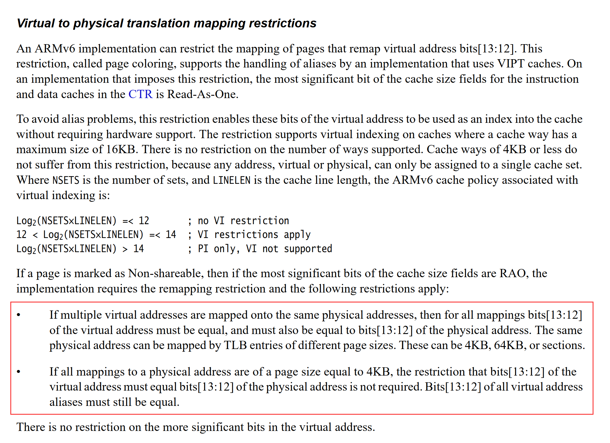

# 【日常技术批判】ARM VIPT 对 linux page_size 影响

很多 QoS 方案都在营造一种氛围，或者说是暗示：kernel 实现了或者应该实现 page coloring 机制。

可是偶然间笔者发现，kernel 根本没有实现 page coloring 的 qos 机制，笔者在这里有点惊了！！因为我们知道 ARM 很多架构 L1 是 VIPT 的，如下图所示：



这样马上就碰到一个问题：不说虚拟化怎么做，首先 ARM page size 可能都有问题了。

翻了下发现 kernel 没有做 page coloring [1, 2]，认为这样可能导致质量受损，[3] 讨论了 page coloring 的质量风险，笔者也有类似的观点：如果下面做的虚拟化和qos策略太复杂，那上面想测个啥，质量问题完全说不清楚了。那么 ARM VIPT 在 kernel 视角该怎么处理呢？

对于允许 shared 的 4KB page，那 VI 是完全随机的，就会有问题。那为啥 intel x86 可以呢，因为人家 index 在 page size 之内。既然这样，[4] 那干脆这里把 page size 扩张，把 index 包含不就好了，这样子 page size 就变成 16KB。

对于 private anonymous page，不会重复映射，也就不会有 aliasing 问题。

看下代码

```c++
/*
 * This should be the size of the virtually indexed cache/ways,
 * or page size, whichever is greater since the cache aliases
 * every size/ways bytes.
 */
#define	SHMLBA	(4 * PAGE_SIZE)		 /* attach addr a multiple of this */

#define COLOUR_ALIGN(addr,pgoff)		\
	((((addr)+SHMLBA-1)&~(SHMLBA-1)) +	\
	 (((pgoff)<<PAGE_SHIFT) & (SHMLBA-1)))

/*
 * We need to ensure that shared mappings are correctly aligned to
 * avoid aliasing issues with VIPT caches.  We need to ensure that
 * a specific page of an object is always mapped at a multiple of
 * SHMLBA bytes.
 *
 * We unconditionally provide this function for all cases, however
 * in the VIVT case, we optimise out the alignment rules.
 */
unsigned long
arch_get_unmapped_area(struct file *filp, unsigned long addr,
		unsigned long len, unsigned long pgoff, unsigned long flags)
{
	struct mm_struct *mm = current->mm;
	struct vm_area_struct *vma;
	int do_align = 0;
	int aliasing = cache_is_vipt_aliasing();
	struct vm_unmapped_area_info info;

	/*
	 * We only need to do colour alignment if either the I or D
	 * caches alias.
	 */
	if (aliasing)
		do_align = filp || (flags & MAP_SHARED);

	/*
	 * We enforce the MAP_FIXED case.
	 */
	if (flags & MAP_FIXED) {
		if (aliasing && flags & MAP_SHARED &&
		    (addr - (pgoff << PAGE_SHIFT)) & (SHMLBA - 1))
			return -EINVAL;
		return addr;
	}

	if (len > TASK_SIZE)
		return -ENOMEM;

	if (addr) {
		if (do_align)
			addr = COLOUR_ALIGN(addr, pgoff);
		else
			addr = PAGE_ALIGN(addr);

		vma = find_vma(mm, addr);
		if (TASK_SIZE - len >= addr &&
		    (!vma || addr + len <= vm_start_gap(vma)))
			return addr;
	}

	info.flags = 0;
	info.length = len;
	info.low_limit = mm->mmap_base;
	info.high_limit = TASK_SIZE;
	info.align_mask = do_align ? (PAGE_MASK & (SHMLBA - 1)) : 0;
	info.align_offset = pgoff << PAGE_SHIFT;
	return vm_unmapped_area(&info);
}
```


这里有个细节，VI 虽然不等于 PI，只要 nr_set = 2^nr_index，这样 index 分组就是唯一的，所以 tag 相等就可以保证命中。不过需要考虑一点是 inclusive cache，比如 L2 evict 了，L1 怎么办呢？因为是拿着 PI 来的？？

简单找了下，没找到相关材料，不清楚是不是和 attr 有关。。

## 参考

- 1 [Re: "Colo[u]rs"](https://yarchive.net/comp/linux/page_coloring.html)
- 2 [Re: Page Colouring (was: 2.6.0 Huge pages not working as expected)](https://lore.kernel.org/lkml/2003Dec27.212103@a0.complang.tuwien.ac.at/)
- 3 [Re: Page Colouring (was: 2.6.0 Huge pages not working as expected)](https://lore.kernel.org/lkml/Pine.LNX.4.58.0312261515550.14874@home.osdl.org/)
- 4 [[PATCH] ARM/shmem: Drop page coloring align for non-VIPT CPUs](https://lore.kernel.org/lkml/20170414100953.4703-1-dsafonov@virtuozzo.com/)
