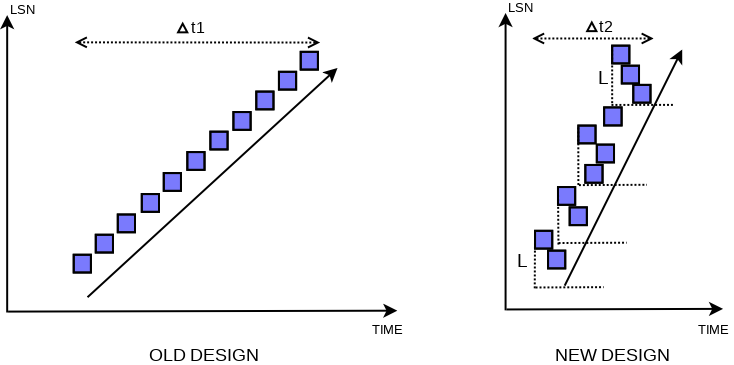

# 【日常技术批判】 InnoDB 确定 checkpoint-lsn 的一处细节

本文假定读者已经拥有相应的背景知识，可以参考 MySQL 8.0: New Lock free, scalable WAL design 等。

现在考虑确定这一轮的 available checkpoint lsn，我们这里简化一下场景，只考察3个 lsn：

- flushed_to_disk_lsn：redo log 已经持久化的点
- flush list 中模糊的 oldest modification：挂载到 flush list 是乱序的，但是注意乱序插入的第一个与实际最小值的差值不会超过 recent_closed.capacity
- recent close：维护推进已经挂载到 flush list 的点



在计算 available checkpoint lsn 时，这三者的访问顺序是有讲究的。但是笔者发现解读 MySQL8.0 WAL design 的文章中鲜有提及，甚至有出现将顺序搞错的情况，因此笔者认为这是一个值得考察的细节。注意到 flushed_to_disk_lsn 可以放到最后访问，给持久化多一点机会。下面只考虑 flush list 的 oldest_modification (lwm) 和 recent_closed.tail (dpa) 两者的偏序关系。

对于 lwm，如果存在 dirty page，那么 lwm 就是其下界；如果不存在 dirty page，就是 0  
对于 dpa，其之前的 lsn 所对应的 dirty page 已经加入过 flush list 了，这是因为  

对于任一 lsn < dpa 作为 oldest_modification，都有   
add to flush list  
&emsp;-> add to recent_closed  
&emsp;&emsp;-> ...  
&emsp;&emsp;&emsp;-> advance tail to some point where dpa locates  
&emsp;&emsp;&emsp;&emsp;-> get dpa  

其中 -> 表示 happens-before 偏序关系，中间省略号表示有限个 advance tail 动作

下面分别讨论 2 种情况：

## 先获取 dpa，然后 lwm

- 若 lwm = 0，由上述偏序关系可知 dpa 之前的 dirty page 已经 flush，因此使用 dpa 是安全的
- 若 lwm 存在，并且 lwm 作为 dirty page lsn 的下界，是否有 lwm < dpa 为真？并非如此，考虑如下情况：

获取 dpa 之后，recent_closed.tail 和 flush 进展都很快。然后获取某个较小的 oldest_modification，再减去 recent_closed.capacity 得到 lwm，可能有 dpa < lwm，这是因为做 checkpoint 时对 add flush 和 flush 的进度没有任何限制。比如说可以在 `mtr_t::Command::execute()` 中 `log_wait_for_space_in_log_recent_closed()` 时控制 tail 增长离 last_checkpoint_lsn 不能太远，比如一个 capacity 的长度，这样一来可以保证 lwm < dpa，但是在设计上引入了耦合，并且带来了 deadlock 的风险。

一个值得注意的点是：当 dpa < lwm 时，为何要选择 dpa？   
笔者认为并没有充足的理由，事实上当 lwm 存在时，使用 lwm 是安全的，这是因为：  
假设 lwm = old' - capacity（old' page 是乱序插入 flush list 中的第一个）  
old' `log_wait_for_space_in_log_recent_closed()`  
&emsp;-> add old' to flush lists  
&emsp;&emsp;-> get lwm = old' - capacity  
注意到 old' wait for space 时有 tail' > lwm，于是对任一 oldest_modification < lwm < tail' 的 page，都有  
add to flush list  
&emsp;-> add to recent_closed  
&emsp;&emsp;-> ...  
&emsp;&emsp;&emsp;-> advance tail to some point where tail' locates  
&emsp;&emsp;&emsp;&emsp;-> old' `log_wait_for_space_in_log_recent_closed()`  
这些 page 都先于 old' page 插入 flush list，因此已经被 flush，于是 lwm 是安全的。（而另一方面，对于 oldest_modification > tail' > lwm 的 page，即使其由于乱序插入导致其实比 old' 更小，但是 lwm 保证其是安全的）  

## 先获取 lwm，然后 dpa

- 若 lwm = 0，这时使用 dpa 显然是不安全的
- 若 lwm 存在，由上文分析知 lwm < dpa 为真

## 总结

只要注意到 wait_for_space, add_to_flush_list, add_link, advance_tail 等所构建的偏序关系，那推演过程就立即成为平凡的。

> 注：本文的分析条件是比较松弛的，事实上可能其他地方的设计会带来额外的约束，这些约束又会建立额外的偏序关系，而笔者并未考察额外的偏序关系。

最后，感兴趣可以验证一下代码：

https://github.com/percona/percona-server/blob/067aff04d9a9cb127f1ef003d1a3f4ed5bf3f0ab/storage/innobase/log/log0chkp.cc#L177

```cpp
static lsn_t log_compute_available_for_checkpoint_lsn(const log_t &log) {
  /* The log_buffer_dirty_pages_added_up_to_lsn() can only increase,
  and that happens only after all related dirty pages have been added
  to the flush lists.

  Hence, to avoid issues related to race conditions, we follow order:

          1. Note lsn up to which all dirty pages have already been
             added to flush lists.

          2. Check buffer pool to get LWM lsn for unflushed dirty pages
             added to flush lists.

          3. Flush lists were empty (no LWM) => use [1] as LWM.

          4. Checkpoint LSN could be min(LWM, flushed_to_disk_lsn). */

  const lsn_t dpa_lsn = log_buffer_dirty_pages_added_up_to_lsn(log);

  lsn_t lwm_lsn = buf_pool_get_oldest_modification_lwm();

  /* We cannot return lsn larger than dpa_lsn,
  because some mtr's commit could be in the middle, after
  its log records have been written to log buffer, but before
  its dirty pages have been added to flush lists. */

  if (lwm_lsn == 0) {
    /* Empty flush list. */
    lwm_lsn = dpa_lsn;
  } else {
    lwm_lsn = std::min(lwm_lsn, dpa_lsn);
  }

  /* Cannot go beyond flushed lsn.

  We cannot write checkpoint at higher lsn than lsn up to which
  redo is flushed to disk. We must not wait for log writer/flusher
  in log_checkpoint(). Therefore we need to limit lsn for checkpoint.
  That's because we would risk a deadlock otherwise - because writer
  waits for advanced checkpoint, when it detected that there is no
  free space in log files.

  However, note that the deadlock would happen only if we created
  log records without dirty pages (during page flush we anyway wait
  for redo flushed up to page's newest_modification). */

  const lsn_t flushed_lsn = log.flushed_to_disk_lsn.load();

  lsn_t lsn = std::min(lwm_lsn, flushed_lsn);

  // ...
  // ...
}
```
