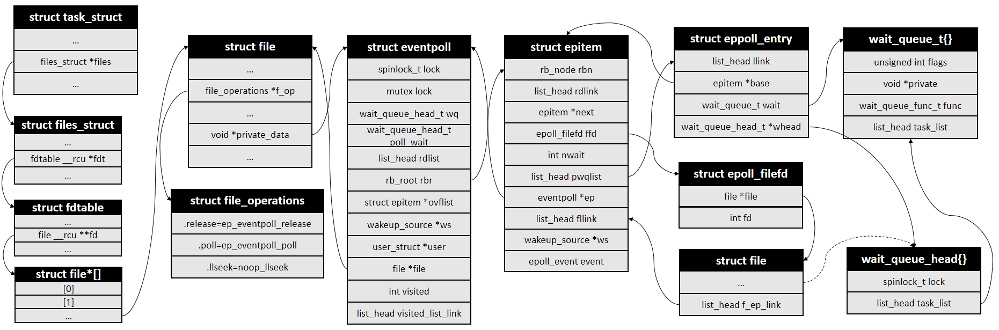

# 【日常技术批判】浅谈侵入式结构的应用

> 为什么要单独写这样一篇呢，原因是笔者发现很多同学都低估了甚至是不了解侵入式结构的用途。在很多场景，侵入式结构都可以显著提高程序可读性，易维护性，效率。  
>   
> 案例中的所有图片均来源于网络。  

- 原理
  - 引入
  - 实现
- 案例
  - RocksDB LRUHandle
  - InnoDB buf_page_t
  - MySQL WHERE cond 拆解 index interval
  - Linux CFS sched_entity
  - Linux epoll
  - Linux rmap
  - 侵入式结构与并发
- Reference

## 原理

### 引入

定位：**侵入式结构是一种代码实现技巧，在某些场景可以提高程序可读性，易维护性，效率**。

场景：**程序中的一些关键数据，需要表达多种逻辑，涉及到多种数据结构**。最经典的例子：hash + lru，需要用 hash 来加快数据检索，同时受限于存储空间，需要用 lru 来判断数据的冷热价值。

如果只有单个结构，当然很好写，但是现在混合结构怎么搞呢？

首先我们想，先写出一种结构作为基础，再把其他结构关联过来是否可行？比如我们先实现一个 lru list，然后把 hash 看作是 kv: (key -> list::iterator)，如下图所示：


可以看到这里是两个分离的结构，比如 lru list 根本感知不到 hash 存在，但是在操作上可以互相作用。比如操作 hash 时，可以拿到对应的 list node；操作 list node 时，可以拿到对应的 key 去访问 hash（这个假设有点强了，事实上 key 可能不是 unique，很麻烦）。这样操作上是可以成立的，但是在效率上是否是最优的呢？

显然不是最优的，可以发现如果从 lru list 中删掉一个节点，那我们需要从这个节点反向操作 hash，就得付出 delete key 的 traverse & compare 开销。相反，如果可以直接定位到对应的 hash node，只要简单 remove node 即可。

> 实际上这也是有优势的：可以在不修改任何现有实现的情况下加入额外的代码（比如这里的 hash）来提供功能，在这个案例中这样开发反而是比较简单快速的。  

接下来我们想，由于多种结构是分离的，就导致从一种结构出发，想操作另一种结构时，需要**当做黑盒来执行完整的端到端操作**。那这时候就要想，能否**降低从操作一种结构转移到操作另一种结构的开销**。那既然不能当做黑盒来访问，那就需要互相能够直接索引到，一个直白的思路就是在每个节点存对方节点的指针，如下图所示：


这样操作和跳转都是局部行为，但是会有一个问题：无法线性扩展。比如相关用户逻辑线性扩展（数据量为 N，M 种逻辑），那么数据存储空间是 O(MN)，存储的指针数量就是 O(M^2 N)，而且代码维护起来也乱套了。进一步想，存指针还需要一层动态跳转，那能否将多种结构直接拼在一起，可以静态跳转，如下图所示：


数据存储空间是 O(N)，存储的指针数量是 O(MN)。显然在一个结构上的操作，可以轻易跳转到另一个结构上，并且由于这种跳转是静态的，我们还可以利用编译器来优雅的实现。

这样我们就初步到达了侵入式结构的一般实现。顺便还可以总结出两点观察：

- 数据操作形态以节点为主（大多数据结构由于动态性都有这种特征）
- 对于数据在不同逻辑中的操作，均表现为在各自节点局部的操作（比如访问邻近节点，删除自己等）


&nbsp;  
### 实现

很简单，把多种结构的代码摆在一起就可以，有两种等价的形式：

第一种形式（编码上不可扩展，不推荐）：

```c++
struct A {
  struct A *next;
  struct A *left, *right;
};

// 按照树形结构找 left child，然后按照链表结构找 next
struct A *left_child_next(struct A *a) {
  return a->left->next;
}
```

第二种形式：

```c++
struct list_node {
  struct list_node *next;
};

struct tree_node {
  struct tree_node *left, *right;
};

struct A {
  struct list_node next;
  struct tree_node tr_node;
};

#define container_of(ptr, type, member) ({ \
     const typeof( ((type *)0)->member ) *__mptr = (ptr); \
     (type *)( (char *)__mptr - offsetof(type,member) );})

// 按照树形结构找 left child，然后按照链表结构找 next
struct list_node *left_child_next(struct tree_node *tr_node) {
  struct A *left_child = container_of(tr_node->left, A, tr_node);
  return left_child->next;
}
```

这里说第一种形式不可扩展的意思是，没法轻松地复用代码，很多地方都要引入额外的局部程序相关的代码。第二种只要写一套基础库代码，之后在任何地方都可以简单使用，可以参考：

- [Intrusive and non-intrusive containers - Boost 1.84.0](https://www.boost.org/doc/libs/1_84_0/doc/html/intrusive/intrusive_vs_nontrusive.html)
- [When to use? - Boost 1.84.0](https://www.boost.org/doc/libs/1_84_0/doc/html/intrusive/usage_when.html)


&nbsp;  
## 案例

### [RocksDB LRUHandle](https://github.com/facebook/rocksdb/blob/cb08a682d4631527c095cccdf22c5f52ef7d3a35/cache/lru_cache.h#L50)

```c++
struct LRUHandle {
  LRUHandle* next_hash;
  LRUHandle* next;
  LRUHandle* prev;
  // ...
};
```


> 图片来源于 [leveldb-handbook - Cache结构](https://leveldb-handbook.readthedocs.io/zh/latest/cache.html#cache)

很好理解，虚线连接的是同一个东西

比如 [删除](https://github.com/facebook/rocksdb/blob/cb08a682d4631527c095cccdf22c5f52ef7d3a35/cache/lru_cache.cc#L596-L602) 的时候，通过 key 从 hashtable 中找到节点，直接从 lru list 中删除：

```c++
void LRUCacheShard::Erase(const Slice& key, uint32_t hash) {
  LRUHandle* e;
  e = table_.Remove(key, hash);
  LRU_Remove(e);
}
```

这里提一个小细节，他的 hash list 是单向的，反过来操作 hash 的时候会有问题。比如说 evict lru，从 lru list 上删除 tail，这个 tail 本身就是 hash list 节点了，但是还需要到 hash table 去走一遍 remove key，因为 hash list 是单向的没法局部操作。不过如果注意到 [hash list 都很短](https://github.com/facebook/rocksdb/blob/cb08a682d4631527c095cccdf22c5f52ef7d3a35/cache/lru_cache.cc#L57-L58) 这一事实，那这样实现确实没毛病：

```c++
    if ((elems_ >> length_bits_) > 0) {  // elems_ >= length
      // Since each cache entry is fairly large, we aim for a small
      // average linked list length (<= 1).
      Resize();
    }
```


&nbsp;  
### [InnoDB buf_page_t](https://github.com/mysql/mysql-server/blob/824e2b4064053f7daf17d7f3f84b7a3ed92e5fb4/storage/innobase/include/buf0buf.h#L1605-L1629)

```c++
class buf_page_t {
  /** Node used in chaining to buf_pool->page_hash or buf_pool->zip_hash */
  buf_page_t *hash;

  /** Based on state, this is a list node, protected by the corresponding list
  mutex, in one of the following lists in buf_pool:

  - BUF_BLOCK_NOT_USED: free, withdraw
  - BUF_BLOCK_FILE_PAGE:        flush_list
  - BUF_BLOCK_ZIP_DIRTY:        flush_list
  - BUF_BLOCK_ZIP_PAGE: zip_clean

  The node pointers are protected by the corresponding list mutex.

  The contents of the list node is undefined if !in_flush_list &&
  state == BUF_BLOCK_FILE_PAGE, or if state is one of
  BUF_BLOCK_MEMORY,
  BUF_BLOCK_REMOVE_HASH or
  BUF_BLOCK_READY_IN_USE. */

  UT_LIST_NODE_T(buf_page_t) list;

  // ...
};
```

其中 UT_LIST_NODE_T 是

```c++
/** The two way list node.
 @tparam Type the list node type name */
template <typename Type>
struct ut_list_node {
  Type *prev; /*!< pointer to the previous
              node, NULL if start of list */
  Type *next; /*!< pointer to next node,
              NULL if end of list */
};
/** Macro used for legacy reasons */

#define UT_LIST_NODE_T(t) ut_list_node<t>
```

整个结构是显而易见的。


&nbsp;  
### [MySQL WHERE cond 拆解 index interval](https://github.com/mysql/mysql-server/blob/824e2b4064053f7daf17d7f3f84b7a3ed92e5fb4/sql/range_optimizer/tree.h#L246-L462)

参考 [1, 2, 3, 4]

举个例子，怎么处理这种复杂 sql where 条件

```sql
create table tmp_sel_arg(kp1 int, kp2 int, kp3 int, kp4 int);
create index ind_tmp_sel_arg on tmp_sel_arg(kp1, kp2, kp3);
select * from tmp_sel_arg where 
    (kp1<1 AND kp2=5 AND (kp3=10 OR kp3=12)) OR 
    (kp1=2 AND (kp3=11 OR kp3=14)) OR 
    (kp1=3 AND (kp3=11 OR kp3=14));
```

简单地说，这里应用前期基础的常量剪枝等手段后，优化器需要判断用这坨条件去访问某个索引的开销是多少，这需要做如下的事：针对某个 possible index，枚举其所有的查询区间。这里的区间指的是，按照索引列前缀排序的，前面的列全为相等条件，只有最后一个允许不等，并且所有区间是不重叠的。枚举完所有区间，再去 innodb 估计这些区间有多少条数据，最终得到访问这个索引的开销。

为了枚举区间，MySQL 做了如下设计：

```c++
/*
  A construction block of the SEL_ARG-graph.

  One SEL_ARG object represents an "elementary interval" in form

      min_value <=?  table.keypartX  <=? max_value

  The interval is a non-empty interval of any kind: with[out] minimum/maximum
  bound, [half]open/closed, single-point interval, etc.

  1. SEL_ARG GRAPH STRUCTURE

  SEL_ARG objects are linked together in a graph, represented by the SEL_ROOT.
  The meaning of the graph is better demonstrated by an example:

     tree->keys[i]
      |
      |             $              $
      |    part=1   $     part=2   $    part=3
      |             $              $
      |  +-------+  $   +-------+  $   +--------+
      |  | kp1<1 |--$-->| kp2=5 |--$-->| kp3=10 |
      |  +-------+  $   +-------+  $   +--------+
      |      |      $              $       |
      |      |      $              $   +--------+
      |      |      $              $   | kp3=12 |
      |      |      $              $   +--------+
      |  +-------+  $              $
      \->| kp1=2 |--$--------------$-+
         +-------+  $              $ |   +--------+
             |      $              $  ==>| kp3=11 |
         +-------+  $              $ |   +--------+
         | kp1=3 |--$--------------$-+       |
         +-------+  $              $     +--------+
             |      $              $     | kp3=14 |
            ...     $              $     +--------+

  The entire graph is partitioned into "interval lists".

  An interval list is a sequence of ordered disjoint intervals over
  the same key part. SEL_ARG are linked via "next" and "prev" pointers
  with NULL as sentinel.

    In the example pic, there are 4 interval lists:
    "kp<1 OR kp1=2 OR kp1=3", "kp2=5", "kp3=10 OR kp3=12", "kp3=11 OR kp3=13".
    The vertical lines represent SEL_ARG::next/prev pointers.

  Additionally, all intervals in the list form a red-black (RB) tree,
  linked via left/right/parent pointers with null_element as sentinel. The
  red-black tree root SEL_ARG object will be further called "root of the
  interval list".

  In an interval list, each member X may have SEL_ARG::next_key_part pointer
  pointing to the root of another interval list Y. The pointed interval list
  must cover a key part with greater number (i.e. Y->part > X->part).

    In the example pic, the next_key_part pointers are represented by
    horisontal lines.
```

上面描述了一个二维链表的结构，表示同一个索引列的 OR 和内部的 AND 结构。

```c++
  2. SEL_ARG GRAPH SEMANTICS

  It represents a condition in a special form (we don't have a name for it ATM)
  The SEL_ARG::next/prev is "OR", and next_key_part is "AND".

  For example, the picture represents the condition in form:
   (kp1 < 1 AND kp2=5 AND (kp3=10 OR kp3=12)) OR
   (kp1=2 AND (kp3=11 OR kp3=14)) OR
   (kp1=3 AND (kp3=11 OR kp3=14))

  In red-black tree form:

                     +-------+                 +--------+
                     | kp1=2 |.................| kp3=14 |
                     +-------+                 +--------+
                      /     \                     /
             +---------+    +-------+     +--------+
             | kp1 < 1 |    | kp1=3 |     | kp3=11 |
             +---------+    +-------+     +--------+
                 .               .
            ......               .......
            .                          .
        +-------+                  +--------+
        | kp2=5 |                  | kp3=14 |
        +-------+                  +--------+
            .                        /
            .                   +--------+
       (root of R-B tree        | kp3=11 |
        for "kp3={10|12}")      +--------+


  Where / and \ denote left and right pointers and ... denotes
  next_key_part pointers to the root of the R-B tree of intervals for
  consecutive key parts.
```

上面描述了同一个 key part 的 OR 用 rbtree 表示。

枚举的动作很简单：第一个维度按照 key part 对应的 rbtree 进行中序遍历；第二个维度按照该 SEL_ARG 的 next key part 进行向后收集条件。最后就得到所有的区间，并且这些区间是有序的。

这里额外提一句，[2] 中说 records_in_range 是用左右两边来估算这一层的 avg recs per page，不过当时有过出现偏差的情况 [5]，[6] 改成从左边连续读 10 page 来估算。


&nbsp;  
### [Linux CFS sched_entity](https://elixir.bootlin.com/linux/v6.7/source/include/linux/sched.h#L551)

> 参考 [7]（以下图片来源于此）

场景大概是这样：把一堆 task 放到 runqueue 去调度，每个 task 有一个加权值作为分数，然后每次选择分数最小的 task 给 quota。这些 task 可能会随时进出 runqueue。分数的更新可以认为是自动的。

思路也比较单纯：首先需要某种结构来存这些 task，并且这个结构最好能提供“低开销获取最小分数”的能力。然后还要有能力让 task 随机进出。

显然 min heap 不适合随机进出这一要求。那最常见的还是回到 rbtree 了，可以均摊 O(1) 提供 leftmost，也能够随机删除节点。设计如下图所示：


```c++
struct sched_entity {
  struct rb_node			run_node;
};

struct task_struct {
  struct sched_entity		se;
};

/*
 * The dequeue_task method is called before nr_running is
 * decreased. We remove the task from the rbtree and
 * update the fair scheduling stats:
 */
static void dequeue_task_fair(struct rq *rq, struct task_struct *p, int flags) {
  struct sched_entity *se = &p->se;
  struct cfs_rq *cfs_rq = cfs_rq_of(se);
  dequeue_entity(cfs_rq, se, flags);
}
```


&nbsp;  
### [Linux epoll](https://elixir.bootlin.com/linux/v6.7/source/fs/eventpoll.c#L130)

> 参考 [8, 9, 10, 11, 12]（以下图片来源于此）


场景：这里需要管理 sock，另外还能操作就绪队列（注意区分 socket 等待队列），并且逻辑上还要关联起来。


这个设计很明显了。再顺几个图：




&nbsp;  
### [Linux rmap](https://elixir.bootlin.com/linux/v6.7/source/include/linux/rmap.h#L82)

> 参考 [13, 14, 15, 16, 17, 18, 19]（以下图片来源于此）

这里并不好把握，笔者曾经好几次都自以为搞明白了，结果后来看到又感觉懵逼。因为这里的需求和质量是在持续演进的，有些地方想搞明白需要研究整个发展历史。另外很多需求没法完整准确的总结出来，要大量翻 ml，就更不用说如何指导设计了。所以这里只是浅尝辄止一下，大概知道要干个啥。

场景：需要从物理地址反向路由到所有 vma，比如回收，迁移的时候。

首先梳理下这样的结构应该有哪些基础能力：

- page 可以关联到多个进程的 vma
- vma 可以找到关联的 page
- 考虑到 vma 变更，page 不好与其直接关联
- 该结构可以处理 vma 变更
- 感觉也说不清楚了。。。

经过了很多次演进之后，大概有这样一种方案：


```c++
/*
 * The copy-on-write semantics of fork mean that an anon_vma
 * can become associated with multiple processes. Furthermore,
 * each child process will have its own anon_vma, where new
 * pages for that process are instantiated.
 *
 * This structure allows us to find the anon_vmas associated
 * with a VMA, or the VMAs associated with an anon_vma.
 * The "same_vma" list contains the anon_vma_chains linking
 * all the anon_vmas associated with this VMA.
 * The "rb" field indexes on an interval tree the anon_vma_chains
 * which link all the VMAs associated with this anon_vma.
 */
struct anon_vma_chain {
	struct vm_area_struct *vma;
	struct anon_vma *anon_vma;
	struct list_head same_vma;   /* locked by mmap_lock & page_table_lock */
	struct rb_node rb;			/* locked by anon_vma->rwsem */
};
```

注意到 anon_vma 是跨 mm 会有 clone。


&nbsp;  
### 侵入式结构与并发

也没啥说的，一般碰到并发问题可能要 case by case 看了。不过侵入式结构有个好处，在做并发设计时要顺畅很多；相反，如果是分离结构，为了保持逻辑上的一致性可能会挖很多坑。

当然也不一定。。


&nbsp;  
## Reference

- 1 [MySQL · 源码分析 · Range (Min-Max Tree)结构分析](http://mysql.taobao.org/monthly/2021/06/03/)
- 2 [MySQL源码：Range优化相关的数据结构](https://www.orczhou.com/index.php/2012/11/mysql-source-code-range-optimize-data-structure/)
- 3 [MySQL源码：Range访问方式相关的数据结构–续](https://www.orczhou.com/index.php/2013/01/mysql-source-code-range-optimize-data-structure-again/)
- 4 [index merge的数据结构和成本评估](https://www.orczhou.com/index.php/2013/03/mysql-source-code-query-optimization-index-merge-structure-cost/)
- 5 [RANGE estimation for matched rows may be 200 times different](https://bugs.mysql.com/bug.php?id=53761)
- 6 [Fix Bug#53761 RANGE estimation for matched rows may be 200 times diff…](https://github.com/percona/percona-server/commit/c292616a7dbbf8cf03c87c61ac22a13d8f7ae4c7)
- 7 [（五）Linux进程调度-CFS调度器](https://mp.weixin.qq.com/s/6as3ZB5s-H9jKtxAorGIfg)
- 8 [从硬件入手深入理解epoll 的本质](https://juejin.cn/post/6844904006301843464)
- 9 [从4个方面分析epoll的实现原理](https://mp.weixin.qq.com/s/ZuqW-SCPZpydjYTl6EvL8g)
- 10 [图解 | 深入揭秘 epoll 是如何实现 IO 多路复用的！](https://mp.weixin.qq.com/s/6JNLyVlE6BWU-zScNuaYvQ)
- 11 [Epoll Kernel Performance Improvements.ppt - Open Source Summit – July 2019.](https://events19.linuxfoundation.org/wp-content/uploads/2018/07/dbueso-oss-japan19.pdf)
- 12 [Linux Kernel Notes: epoll Implementation Principle](https://programming.vip/docs/linux-kernel-notes-epoll-implementation-principle.html)
- 13 [逆向映射的演进](http://www.wowotech.net/memory_management/reverse_mapping.html)
- 14 [linux内存源码分析 - 内存回收(匿名页反向映射)](https://www.cnblogs.com/tolimit/p/5398552.html)
- 15 [（十五）Linux内存管理之RMAP](https://mp.weixin.qq.com/s/B2eahWUzOnkz6Tc6mihRHA)
- 16 [反向映射rmap](https://mp.weixin.qq.com/s/o_2umwlRTt7jMaY4V_2lww)
- 17 [深入剖析Linux內核反向映射機制](https://www.gushiciku.cn/pl/pwLk/zh-hk)
- 18 [LWN 75198: 虚拟内存专题二：基于对象的反向映射（object-based reverse mapping，简称 objrmap）的回归](https://tinylab.org/lwn-75198/)
- 19 [图解内存匿名反向映射reverse mapping](https://cloud.tencent.com/developer/article/1700399)
