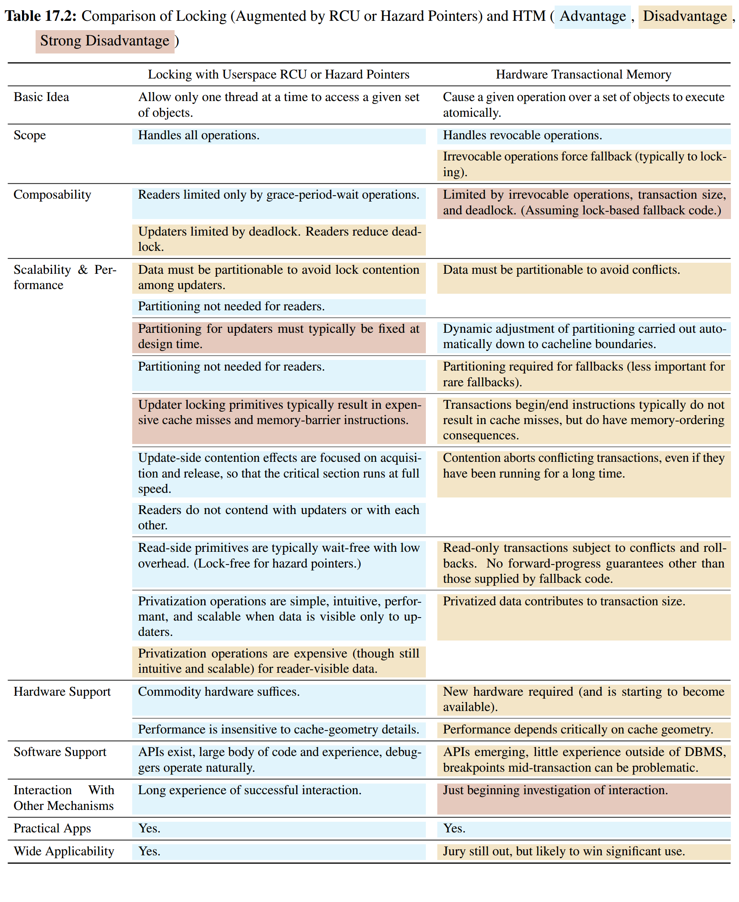
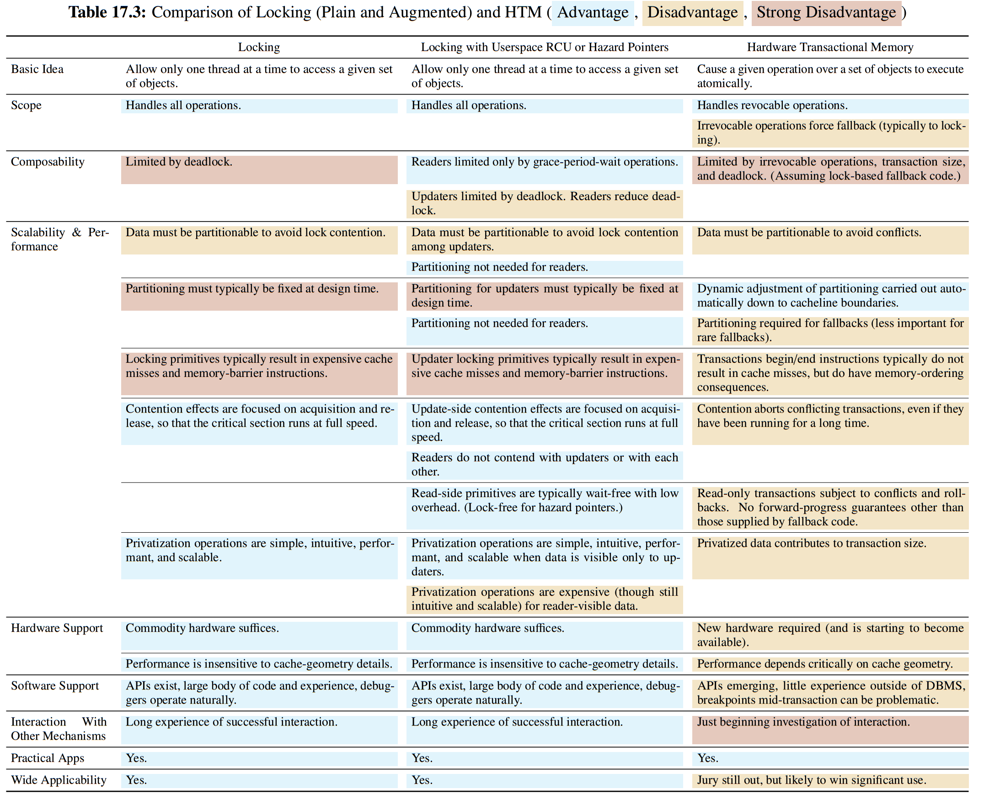

# [Is Parallel Programming Hard, And, If So, What Can You Do About It?](https://mirrors.edge.kernel.org/pub/linux/kernel/people/paulmck/perfbook/perfbook.html) 学习笔记

- [1-4 Introduction](#1-4)
- [5 Counting](#5)
- [6 Partitioning and Synchronization Design](#6)
- [7 Locking](#7)
- [8 Data Ownership](#8)
- [9 Deferred Processing](#9)
- [10 Data Structures](#10)
- [11 Validation](#11)
- [12 Formal Verification](#12)
- [13 Putting It All Together](#13)
- [14 Advanced Synchronization](#14)
- [15 Advanced Synchronization: Memory Ordering](#15)
- [16 Ease of Use](#16)
- [17 Conflicting Visions of the Future](#17)

## 参考

- [P0668R5: Revising the C++ memory model](http://www.open-std.org/jtc1/sc22/wg21/docs/papers/2018/p0668r5.html)：待评价（大坑）
- [[intro.races]](http://eel.is/c++draft/intro.races)：本质上阐述了偏序关系的概念，但似乎仍有些模糊
- [[atomics.order]](http://eel.is/c++draft/atomics.order)


&nbsp;   
<a id="1-4"></a>
## 1-4 Introduction


- load tearing
  - 编译器用多个 load 表示一个 access
- store tearing
  - 编译器用多个 store 表示一个 access
- load fusing
  - 编译器使用之前的 load 结果（register），而非再次 load
  - `READ_ONCE(x)`
- store fusing
  - 编译器会把对同一内存位置的 store 合并成只有最后一个（*什么鬼玩意？*）
- compiler reordering
  - 事实上，cpp 保证 [Order of evaluation](https://en.cppreference.com/w/cpp/language/eval_order), [6.9.1 Sequential execution](http://eel.is/c++draft/intro.execution#8)
- invented loads：什么玩意
- invented stores：什么玩意
- volatile
  - [P1152R4 Deprecating volatile](http://www.open-std.org/jtc1/sc22/wg21/docs/papers/2019/p1152r4.html)
  - [P1382R1 volatile_load<T> and volatile_store<T>](http://www.open-std.org/jtc1/sc22/wg21/docs/papers/2019/p1382r1.pdf)
  - [Nine ways to break your systems code using volatile](https://blog.regehr.org/archives/28)


&nbsp;   
<a id="5"></a>
## 5 Counting

- 减少 interconnection，把计算分割到局部
- fast path 应该额外开销极小
- slow path 允许有重开销，但是要控制其发生频率


&nbsp;   
<a id="6"></a>
## 6 Partitioning and Synchronization Design

- 分析 workload，控制流，数据流
- 切割任务
- 分析开销
  - multicore
  - 临界区
  - 非临界区
  - 同步原语
  - cacheline contention
- 同步粒度
  - 数据所有权
  - 动态结构被释放，锁怎么办
- 常用手段
  - pthread系列（futex-based）
  - slow path
      - rwlock
      - RCU
      - 层次锁（意向锁）


&nbsp;   
<a id="7"></a>
## 7 Locking

- futex based
- atomic instruction based
- 注意回调函数，信号处理函数，库函数


&nbsp;   
<a id="8"></a>
## 8 Data Ownership

- 任务切割
  - 控制流，数据流
- signal 输送函数


&nbsp;   
<a id="9"></a>
## 9 Deferred Processing

> 防止在获取引用（计数）时，并发地删除数据。   
> 用足够小的开销，构建意义足够丰富的 *happens-before* 关系。   

### Hazard Pointer

考虑这样一个场景：

1. 一个容器内有共享资源，对外提供 `get(k)` 和 `remove(k)`，对于同一个元素来说，所有的 `get(k)` 和 `remove(k)` 应该保证是原子的，有 total order（*hash单链表CAS符合语义？*）。另一种情况是资源就只有固定数目的指针，这样只用CAS就trivial了。   
2. 每个线程有一个 inused pool（**论文中是放在全局**），维护自己正在使用的资源handle，资源handle是通过 `get(k)` 获取的。这个 inused pool 允许其他线程读。   
3. 若线程想释放一个资源，先 `remove(k)`，若成功，则在该资源保证不会被其他线程访问的前提下将其释放。（*优化：可以放入 retire list 中，这里假设每一轮都要尝试直接释放*）   

现在要处理的就是③，当 `remove(k)` 成功后，何时可以安全释放资源？

一个简单方法就是使用 rcu：`remove(k)` 之后调用 `synchronize_rcu() / call_rcu(...)`，这种情况连 inused pool 都不需要了。不过我们这里主要讨论基于每线程 inused pool 的方法：

- 访问线程
  - `get(k)`
  - insert 到当前线程（或全局）的 inused pool
  - `reget(k)` 决定是否访问
      - 要保证一定查询的是原来那个元素，有可能发生一种情况：`remove(k)` 之后释放了资源，但是另一个资源重新加入容器，同样的 `k`，又恰好分配到这个地址，即ABA问题。也有可能发生ABA问题，但可以继续使用。
- 删除线程
  - `remove(k)`
  - check 每个线程（或全局）的 inused pool
  - （等待）释放
      - 如果不想等待，那就存到 thread_local retire list，我们这里假设每轮都去尝试释放

思路就是 check 每个线程的 inused pool，若没有则进行释放，若有则等待。现在考虑线程在 `get(k)` 和 加入自己的 inused pool 之间有可能发生遗漏，即另一个线程 check 完毕自己才把资源加入 inused pool。这时需要重新想容器中 `reget(k)` 该资源是否存在，若不存在，则放弃访问。事实上这要求如下2点：

- `remove(k)` 要 *happens-before* `reget(k)`
  - 这要求 check *happens-before* insert
  - 这里要注意 check 和 insert 的并发问题，通常使用链表，那么问题就变成 load(check) 不到 store(insert)，就构成 *happens-before*。
- `reget(k)` 要保证查询的是原来那个资源，防止ABA问题，可以考虑加上标记。即使发生ABA问题，也可能可以继续使用。

简单观察易知：释放工作恰好执行一次；释放时已经不可能有线程访问该资源。

#### Hazard Pointer 用法

常用于固定指针的资源访问，读多写少

- 读者
  - acquire hzdptr
  - 将要指针放入 hzdptr，并再次检查
  - 访问数据
  - release hzdptr
- 写者
  - copy旧资源，并修改，然后 CAS
  - 将旧资源放入 retire list
  - 进行释放工作，即 scan(check) hzdptr 链表

#### Reference

- [Hazard Pointers: Safe Memory Reclamation for Lock-Free Objects](http://citeseerx.ist.psu.edu/viewdoc/download?doi=10.1.1.395.378&rep=rep1&type=pdf)
- [Lock-Free Data Structures with Hazard Pointers](http://citeseerx.ist.psu.edu/viewdoc/download?doi=10.1.1.112.6406&rep=rep1&type=pdf)
- [P0233R6 Hazard Pointers - Safe Resource Reclamation for Optimistic Concurrency](http://www.open-std.org/jtc1/SC22/wg21/docs/papers/2017/p0233r6.pdf)
- [Lock-free memory reclamation with hazard pointers - SO](https://stackoverflow.com/questions/25204494/lock-free-memory-reclamation-with-hazard-pointers)
- [Hazard Pointers vs RCU](http://concurrencyfreaks.blogspot.com/2016/08/hazard-pointers-vs-rcu.html)
- [Are Hazard Pointers Lock-Free or Wait-Free ?](http://concurrencyfreaks.blogspot.com/2016/10/are-hazard-pointers-lock-free-or-wait.html)
- [Hazard Pointer - kongfy](http://blog.kongfy.com/2017/02/hazard-pointer/)
- [并行编程中的内存回收Hazard Pointer](http://codemacro.com/2015/05/03/hazard-pointer/)

### Sequence Lock

- 资源**位置固定**
- 多读一（少）写，读者不阻塞
- critical section
  - 单步操作**保证是原子的**
  - **indirect access** 的并发另说
- 退出时检查 seq 来保证整个 critical section 的读是一致的 txn

### RCU

- 资源通过间接寻址
- 多读一写，读者不阻塞
  - 写者：修改间接寻址
  - 读者：不修改间接寻址，但可以修改位置固定的内容
- 读者使用 `rcu_read_lock()` 和 `rcu_read_unlock()` 来界限临界区
- 写者先对数据进行一些修改，然后使用 `synchronize_rcu()` 来确保没有人访问到旧数据，最后释放

#### synchronize_rcu

`synchronize_rcu()` 提供的语义是：读事件（`rcu_read_lock() ... rcu_read_unlock()` 中包裹的过程）不同时并发于 写事件（`rcu_assign_pointer()`） 和 回收事件（`kfree()`）。这等价于：对于任一读事件

- 要么 读事件 *happens-before* 回收事件
- 要么 写事件 *happens-before* 读事件

更进一步：**对于任一读事件，一定存在一个事件`e`位于 `synchronize_rcu()` 过程中，使得**

- **要么 读事件 *happens-before* 事件`e1`**
- **要么 事件`e2` *happens-before* 读事件**
- 注意到 读事件 与 `synchronize_rcu()`过程 可以是并发的

#### RCU 实现

> 通过各种手段来构建 *happens-before*

- **per CPU lock**：`synchronize_rcu()` 拿一遍所有锁
  - 利用 `unlock()` *happens-before* subsequent `lock()`
- **refcount based**：`rcu_read_lock()` 增加 count；`rcu_read_unlock()` 减少 count；`synchronize_rcu()` 等待 count 清零
  - 利用 count 操作是全局有序的（[std::memory_order_seq_cst](http://eel.is/c++draft/atomics.order#7)，**虽然这个语义可能有问题，但我这里假设 load 不到 inc 就是 happens before 了！！！**），**与 `synchronize_rcu()` 中的 load 构建 *happens-before* 关系**
      - 如果 inc -> load，则 dec -> cmp 0，符合语义
      - 如果 load -> inc，符合语义
  - 缺点
      - cacheline contention
          - 解决方案：per CPU count
      - 写者饥饿
          - 解决方案：使用2个计数器。不应该等待 `synchronize_rcu()` “之后开始” 的读者，因此需要构建 *happens-before* 关系，使得这些读者不影响 count。
          - 假设两个计数器A和B，由 `synchronize_rcu()` 指定使用哪个计数器（假设开始使用A）。`synchronize_rcu()` 先更新当前使用的计数器为B，然后等待计数器A清零；然后更新当前使用的计数器为A，然后再等待计数器B清零。
          - 在两个计数器上都 wait 构建了 *happens-before*，`rcu_read_lock()` 中的 inc 与 `synchronize_rcu()` 的2个 wait 之一存在 *happens-before*，因此同上符合语义。
          - 为什么要 wait B 呢？事实上 inc B 不一定是这个 `synchronize_rcu()` “之后”发生的，可能是2轮之前的 `synchronize_rcu()` 之后的。
          - 顺序是
              - flip A to B
              - wait(A)（*与上一条组成 `flip_and_wait(A)`*）
              - flip B to A
              - wait(B)（*如果展开写这条可以放在最前面比较好*）
          - 针对 `synchronize_rcu()` 的并发进一步优化：观察到如果一开始抢不到锁，那么之后可以不等待或减少等待（如果写者并发不严峻就不需要）
              - 使用 count 记录轮数（`flip_and_wait()` 时更新），在拿锁之前第一次读 count 轮数
              - 拿锁后第二次读 count 轮数，若与之前相比跨过了几个 `flip_and_wait()`
                  - 超过 3 轮，直接返回
                      - 为什么是3？因为保证至少涉及 2 个`synchronize_rcu()`，并且最后那个一定是完整的，被第一次读和拿锁包围，用这个 `synchronize_rcu()` 来构建 *happens-before*
                  - 正好 2 轮，执行 1 次 `flip_and_wait()`
                      - 第一轮不能算，所以补一轮，和第二轮一共 2 个 wait 构建 *happens-before*
                  - 不到 2 轮，执行 2 次 `flip_and_wait()`
                      - 强行制造 2 次 wait，构建 *happens-before*
- **sequence 标记**：类似 sequence lock。`rcu_read_lock()` 存储 seq+1（奇数） 到 local；`rcu_read_unlock()` 存储当前 seq 到 local；`synchronize_rcu()` 将 seq+2，偶数递增，然后等待各 thread_local 直到其**不再是“比自己小的奇数”**
  - 通过 local 的 store 和 wait(load) 来构建 *happens-before*
  - 注意到“比自己小的偶数”是合法的，读者早已离开
  - 读性能很好，只有 load，读端不允许嵌套
  - 为什么要用递增偶数，0-1互换也可以？因为0-1互换可能导致饥饿
  - 事实上，`rcu_read_unlock()` 只要存储偶数（比如0）到 local 就可以
- **可嵌套的 sequence 标记**：将 seq 低若干位作为嵌套层数（默认不会溢出）。`rcu_read_lock()` 若为最外层，则存储 seq+1 到 local，否则只将 local+1；`rcu_read_unlock()` 将 local-1；`synchronize_rcu()` 将 seq+一个单位，然后等待各 thread_local 直到其 >= seq，或者读者早已离开（`rcu_gp_ongoing(t)`）
  - 通过最外层 `rcu_read_lock()` 的 store local 构建 *happens-before*（注意到只有最外层会 load seq，内层只有+1嵌套层数）

#### RCU List

TODO：并发语义


#### RCU 用途

若不修改间接寻址，则可以不阻塞。当然提交是否原子性要看算法逻辑了。

- RCU 作为 rwlock
- SRCU：读者允许被切
- 并发数据结构的回收

常见用法：对于共享资源，基于refcnt。但是获取资源时并非从现有资源进行共享（例如共享指针），而是从容器中搜索，这意味着获取资源操作需要被检查。

- get：获取一个资源handle
- put：释放资源handle

```c++
T* get(...) {
    rcu_read_lock();
    defer(rcu_read_unlock());
    T* ptr;
    // ... search in container
    ptr = rcu_dereference(...);
    if(ptr) {
        if(atomic_inc_not_zero(ptr->count_)) {
            return nullptr;
        }
    }
    return ptr;
}

void put(T* ptr, void(*release_callback)(T*)) {
    if(atomic_dec_and_test(ptr->count_)) {
        call_rcu(&ptr->rcu_head_, release_callback);
    }
}
```

#### RCU 总结

- 读端应该开销极小：cache miss, cacheline contention
- 读端嵌套
- 读端原语应该可以在所有上下文中使用
- **存在担保**

#### Reference

- [linux/Documentation/RCU](https://github.com/torvalds/linux/tree/master/Documentation/RCU)
- [What is RCU?.txt](https://www.kernel.org/doc/Documentation/RCU/whatisRCU.txt)
- [A Tour Through RCU's Requirements](https://www.kernel.org/doc/Documentation/RCU/Design/Requirements/Requirements.html)
- [Introduction to RCU](http://www2.rdrop.com/users/paulmck/RCU/)
- [What is RCU, Fundamentally? - LWN](https://lwn.net/Articles/262464/)
- [What is RCU? Part 2: Usage - LWN](https://lwn.net/Articles/263130/)
- [RCU part 3: the RCU API - LWN](https://lwn.net/Articles/264090/)
- [Hierarchical RCU - LWN](https://lwn.net/Articles/305782/)
- [Sleepable RCU - LWN](https://lwn.net/Articles/202847/)
- [Priority-Boosting RCU Read-Side Critical Sections - LWN](https://lwn.net/Articles/220677/)
- [Review Checklist for RCU Patches.txt](https://www.kernel.org/doc/Documentation/RCU/checklist.txt)
- [User-space RCU - LWN](https://lwn.net/Articles/573424/)
- [User-space RCU - Hacker News](https://news.ycombinator.com/item?id=17743742)
- [P0279R1 Read-Copy Update (RCU) for C++](http://www.open-std.org/jtc1/sc22/wg21/docs/papers/2016/p0279r1.pdf)
- [Yet another introduction to Linux RCU.ppt](https://www.slideshare.net/vh21/yet-another-introduction-of-linux-rcu)
- [folly/folly/synchronization/Rcu.h](https://github.com/facebook/folly/blob/master/folly/synchronization/Rcu.h)
- [Linux 2.6内核中新的锁机制 - RCU](https://www.ibm.com/developerworks/cn/linux/l-rcu/index.html)
- [使用RCU技术实现读写线程无锁](http://codemacro.com/2015/04/19/rw_thread_gc/)
- [Linux 核心設計: RCU 同步機制](https://hackmd.io/@sysprog/linux-rcu?type=view)
- [Linux2.6.23 ：sleepable RCU的实现](http://www.wowotech.net/kernel_synchronization/linux2-6-23-RCU.html)
- [Verification of Tree-Based Hierarchical Read-Copy Update in the Linux Kernel](http://www.kroening.com/papers/date2018-rcu.pdf)
- [Supplementary Material for User-Level Implementations of Read-Copy Update](https://www.researchgate.net/publication/228865533_Supplementary_Material_for_User-Level_Implementations_of_Read-Copy_Update)


&nbsp;   
<a id="10"></a>
## 10 Data Structures

> 脱离 **控制流** 和 **数据流** 谈论结构是没有意义的   
> 设计之前要分析 data access pattern 和 控制流   
> 因为没有具体的 data access pattern 本章主要分析 hash   

假设 access pattern 关联性不强，那么 hash 是很好的并行数据结构选择。

很多场景下，hash 作为数据结构快速检索的工具，采用了**侵入式结点设计**，要注意**并发**问题。

- 考虑 NUMA，cacheline contention
- 读侧重场景
  - RCU
  - hzdptr

### rehash with RCU

<p/>

<p/>

<p/>

<p/>

- rehash 对原来元素重新计算 hash 并分配进新的桶
- rehash 可以与 find/add/del 并发进行
- rehash 不更改原来链表指针结构，只更改另一条链表指针结构。所以读原来链没问题
- 维护一个 resize_cur 表示已经重新计算到这个桶了。若查询之前的桶，可以访问新表
- 对单条链表的 add/del 操作是上自旋锁的

### 其他

- trie
  - [[patch 0/3] 2.6.17 radix-tree: updates and lockless](https://lkml.org/lkml/2006/6/20/235)
- 平衡树
  - [Scalable address spaces using RCU balanced trees](https://dl.acm.org/doi/10.1145/2189750.2150998)
- 跳表
  - [CONCURRENT MAINTENANCE OF SKIP LISTS](https://users.cs.fiu.edu/~fortega/storage/cop5725/Topic%20List%20Papers/07-oltpindexes1/pugh-concurrent-tr1990.pdf)

### 数据结构实现硬件方面考虑

- 尽可能将数据分割，根据竞争场景考虑并发控制的选择
- 缓存行对齐，避免伪共享
  - 尤其是锁与其保护的数据
- 多读的数据放在开头，多写的数据放在末尾，较少访问的放在中间
- 事务性内存

### Reference

- [Resizable, Scalable, Concurrent Hash Tables via Relativistic Programming](https://www.usenix.org/legacy/event/atc11/tech/final_files/Triplett.pdf)
- [Re: [PATCH 6/13] bridge: Add core IGMP snooping support](https://marc.info/?l=linux-netdev&m=126860770205032&w=2)
- [Re: [Lse-tech] Re: RFC: patch to allow lock-free traversal of lists with insertion](https://lkml.org/lkml/2001/10/13/105)
- [URCU-protected queues and stacks - LWN](https://lwn.net/Articles/573433/)
- [URCU-protected hash tables - LWN](https://lwn.net/Articles/573431/)


&nbsp;   
<a id="11"></a>
## 11 Validation


&nbsp;   
<a id="12"></a>
## 12 Formal Verification


&nbsp;   
<a id="13"></a>
## 13 Putting It All Together

### 常见案例

- 对于共享数据的生命周期计数，获取是从容器中获取，可以考虑 RCU
- 固定位置放多个数据，可以考虑 sequence-lock。但如果要求 txn 语义，就需要一些动态的间接寻址，这时可以考虑 RCU/hzdptr
- 考虑 RCU 复制开销过大


&nbsp;   
<a id="14"></a>
## 14 Advanced Synchronization

### 并行实时计算

<p/>

<p/>

- 事件驱动
  - timer
  - bottom half
  - priority inheritence
- 轮询


&nbsp;   
<a id="15"></a>
## 15 Advanced Synchronization: Memory Ordering

> 本来写了挺多，现在删了不少。这玩意神坑，慎入。

### 本质上来说，在设计基于 atomic-op 的并发程序时，首先考虑整个算法的控制流程；然后给出一个伪代码的描述，并且确定哪些地方需要保证偏序关系；最后在编写程序时使用 fence 或 ordering 原语，将这些偏序关系实体化。

### 基础原语和保证

- 简单 load/store 是原子的
  - [《IA32 sdm》](https://software.intel.com/en-us/articles/intel-sdm) Vol3.Ch8.1.1 Guaranteed Atomic Operations
  - 当然 IA32 后面给了一些额外福利，我们这里忽略
- **单个变量的写拥有 total order**
  - [[intro.races#4 modification order]](http://eel.is/c++draft/intro.races#4)（事实上这里面问题很多）
  - [[atomics.order#4 seq_cst]](http://eel.is/c++draft/atomics.order#4)（三不管问题的遮羞布）
      - 这暗示了一种 linear extension：偏序是可以退化为全序的
- **偏序关系** (*happens-before*)
  - fence (*sequenced-before*)
  - read from (*synchronized-with*)
- 依赖 与 *happens-before*
  - 对于 控制依赖 和 数据依赖，各个平台架构处理不统一
  - 建议使用 `std::memory_order_acquire`，不推荐使用 `std::memory_order_consume`
      - [P0668R5: Revising the C++ memory model](http://www.open-std.org/jtc1/sc22/wg21/docs/papers/2018/p0668r5.html)
      - [P0371R1: Temporarily discourage memory_order_consume](http://www.open-std.org/jtc1/sc22/wg21/docs/papers/2016/p0371r1.html)
      - [P0190R4: Proposal for New memory order consume Definition](http://www.open-std.org/jtc1/sc22/wg21/docs/papers/2017/p0190r4.pdf)
      - [P0462R1: Marking memory order consume Dependency Chains](http://www.open-std.org/jtc1/sc22/wg21/docs/papers/2017/p0462r1.pdf)

> relaxed 我理解大概就是   
> 1. 一个 core 可以看到满足偏序关系的任何一种全序展开（seq_cst 是所有 core 都看到同一种）   
> 2. 所有展开不能违背单个变量的 modification order（是否意味着 modification order 可以导致 “运行时的 *happens-before*”？）   

### Reference

- [[intro.races]](http://eel.is/c++draft/intro.races)
- [[atomics.order]](http://eel.is/c++draft/atomics.order)
- [N2153: A simple and efficient memory model for weakly-ordered architectures](http://www.open-std.org/jtc1/sc22/wg21/docs/papers/2007/n2153.pdf)
- [N2176: Memory Model Rationales](http://open-std.org/jtc1/sc22/wg21/docs/papers/2007/n2176.html)
- [N2664: C++ Data-Dependency Ordering: Atomics and Memory Model](http://www.open-std.org/jtc1/sc22/wg21/docs/papers/2008/n2664.htm)
- [P0668R5: Revising the C++ memory model](http://www.open-std.org/jtc1/sc22/wg21/docs/papers/2018/p0668r5.html)
- [P1217R2: Out-of-thin-air, revisited, again](http://www.open-std.org/jtc1/sc22/wg21/docs/papers/2019/p1217r2.html)
- [N3710: Specifying the absence of "out of thin air" results (LWG2265)](http://www.open-std.org/jtc1/sc22/wg21/docs/papers/2013/n3710.html)
- [Outlawing Ghosts: Avoiding Out-of-Thin-Air Results](https://static.googleusercontent.com/media/research.google.com/en//pubs/archive/42967.pdf)
- [P2055R0: A Relaxed Guide to memory_order_relaxed](http://www.open-std.org/jtc1/sc22/wg21/docs/papers/2020/p2055r0.pdf)
- [P1239R0: Placed Before](http://www.open-std.org/jtc1/sc22/wg21/docs/papers/2018/p1239r0.html)
- [there's a	happens-before orderhere. right?](https://www.decadent.org.uk/pipermail/cpp-threads/2008-December/001893.html)
- [LKML: Linus Torvalds: Re: Memory corruption due to word sharing](https://lkml.org/lkml/2012/2/1/521)
  - Linus 对于过度讨论 memory ordering 的批判。认为应该追求黑箱封装，但是无法阻挡底层社区把脏细节向上抛的趋势。本来可以把这些脏细节在某一层屏蔽抽象出来，但是底层社区为了追求一些好东西（比如性能），把这些脏细节向上抛。
  - 原因可能在于：首先不可能要求所有 target 统一；其次，为了追求所谓的好东西，他们也不想在这层做抽象把细节屏蔽。于是就保留下来，把脏细节向上抛，并给出非常复杂的 spec。
  - 这事实上导致了一种矛盾：从软件架构设计的角度看，其实是希望一种黑箱模块化，服务化的抽象，是把东西分解然后向下推；而把细节向上推通常会导致模块间的依赖更加复杂，甚至有可能互相渗透细节，耦合度大大增加，给理解和维护带来困难。
- [Explicit vs implicit barriers By: Linus Torvalds](https://www.realworldtech.com/forum/?threadid=72498&curpostid=72589)
- [Why OoO stores are evil but OoO loads are o.k.? By: Linus Torvalds](https://www.realworldtech.com/forum/?threadid=72498&curpostid=72596)
- [Weakly ordered WC stores in Haswell By: Linus Torvalds](https://www.realworldtech.com/forum/?threadid=153317&curpostid=153438) 关于 barrier 真正需要什么
- [Example of memory ordering causing excitement in the real world By: Linus Torvalds](https://www.realworldtech.com/forum/?threadid=151073&curpostid=151271) 为什么 weak memory model 不好
- [N2745: Example POWER Implementation for C/C++ Memory Model](http://www.open-std.org/jtc1/sc22/wg21/docs/papers/2008/n2745.html)
- [P0098R1: Towards Implementation and Use of memory order consume](http://www.open-std.org/jtc1/SC22/wg21/docs/papers/2016/p0098r1.pdf)
- [LINUX KERNEL MEMORY BARRIERS](https://www.kernel.org/doc/Documentation/memory-barriers.txt)
- [Memory barriers for TSO architectures](https://lwn.net/Articles/576486/)
- [P0124R7: Linux-Kernel Memory Model](http://www.open-std.org/jtc1/sc22/wg21/docs/papers/2020/p0124r7.html)
- [A formal kernel memory-ordering model (part 1)](https://lwn.net/Articles/718628/)
- [A formal kernel memory-ordering model (part 2)](https://lwn.net/Articles/720550/)
- [《Intel® 64 and IA-32 Architectures Software Developer Manuals》](https://software.intel.com/en-us/articles/intel-sdm)
- [《ARM Architecture Reference Manual ARMv7-A and ARMv7-R edition》](https://static.docs.arm.com/ddi0406/c/DDI0406C_C_arm_architecture_reference_manual.pdf)
- [《riscv-spec》](https://github.com/riscv/riscv-isa-manual/releases)
- [LLVM Atomic Instructions and Concurrency Guide](https://llvm.org/docs/Atomics.html)
- [llvm/docs/Atomics.rst](https://github.com/llvm/llvm-project/blob/master/llvm/docs/Atomics.rst)
- [C/C++11 mappings to processors](https://www.cl.cam.ac.uk/~pes20/cpp/cpp0xmappings.html)
- [Store-to-Load Forwarding and Memory Disambiguation in x86 Processors](http://blog.stuffedcow.net/2014/01/x86-memory-disambiguation/)
- A Memory Model for RISC-V [ppt1](https://www.bsc.es/sites/default/files/public/u1810/arvind_0.pdf), [ppt2](https://riscv.org/wp-content/uploads/2016/12/Tue1130-RISC-V-memory-model-Vijayaraghavan-MIT-V2.pdf)
- [《Memory Consistency Models for Shared-Memory Multiprocessors - WRL Research Report 95/9》](https://www.hpl.hp.com/techreports/Compaq-DEC/WRL-95-9.pdf)
- [A better x86 memory model: x86-TSO (extended version)](https://www.cl.cam.ac.uk/~pes20/weakmemory/x86tso-paper.pdf)
- [A Tutorial Introduction to the ARM and POWER Relaxed Memory Models](https://www.cl.cam.ac.uk/~pes20/ppc-supplemental/test7.pdf)
- [Relaxed-Memory Concurrency](https://www.cl.cam.ac.uk/~pes20/weakmemory/)
- [P1875R0: Transactional Memory Lite Support in C++](http://open-std.org/JTC1/SC22/WG21/docs/papers/2019/p1875r0.pdf)
- [P2066R1: Suggested draft TS for C++ Extensions for Minimal Transactional Memory](http://www.open-std.org/jtc1/sc22/wg21/docs/papers/2020/p2066r1.html)
- [Atomic/GCC/MMOptimizations/Details](https://gcc.gnu.org/wiki/Atomic/GCCMM/Optimizations/Details)
- [The C++11 Memory Model and GCC](https://gcc.gnu.org/wiki/Atomic/GCCMM)
- [CppMem: Interactive C/C++ memory model](http://svr-pes20-cppmem.cl.cam.ac.uk/cppmem/)
- [Memory Barriers: a Hardware View for Software Hackers](http://citeseerx.ist.psu.edu/viewdoc/download?doi=10.1.1.152.5245&rep=rep1&type=pdf) 7.1 Alpha partitioned cache
- [Specifying Weak Memory Consistency with Temporal Logic](https://pdfs.semanticscholar.org/19cf/98bb1a4cf0e66ed1e7780d230c96d6848052.pdf)
- [Fences in Weak Memory Models](http://www0.cs.ucl.ac.uk/staff/J.Alglave/papers/cav10.pdf)
- [P1135R5: The C++20 Synchronization Library](http://www.open-std.org/jtc1/sc22/wg21/docs/papers/2019/p1135r5.html)
- [P0514R4: Efficient concurrent waiting for C++20](http://www.open-std.org/jtc1/sc22/wg21/docs/papers/2018/p0514r4.pdf)
- [《The Architecture of the Nehalem Processor and Nehalem-EP SMP Platforms》](http://citeseerx.ist.psu.edu/viewdoc/download?doi=10.1.1.455.4198&rep=rep1&type=pdf)
- [《Processor Microarchitecture an Implementation Perspective》](https://mcai.github.io/resources/ebooks/SLCA/Processor_Microarchitecture_an_Implementation_Perspective.pdf)
- [《A Primer on Memory Consistency and Coherence》](http://citeseerx.ist.psu.edu/viewdoc/download?doi=10.1.1.225.9278&rep=rep1&type=pdf)
- [preshing 系列文章](https://preshing.com/)


&nbsp;   
<a id="16"></a>
## 16 Ease of Use


&nbsp;   
<a id="17"></a>
## 17 Conflicting Visions of the Future

### Hardware Transactional Memory

- 要求占有全部缓存行
- 冲突处理：read/write set
- abort / rollback
- 中断，陷阱，异常
- 向前执行保证

<p/>

<p/>

<p/>
