# 浅谈 Query Code Generation

- [Codegen 原理](#1)
  - 动机
  - 开销比较
  - Codegen 生成代码原理
- [业界实践](#2)
- [与 pipeline 执行模型的结合](#3)
- [最后](#4)


&nbsp;  
<a id="1"></a>
## Codegen 原理

### 动机

背景：查询处理瓶颈由磁盘IO变为处理器利用率（即有效指令占比）及缓存命中率。

传统执行采用在查询计划上用 Volcano-Iterator 模型做 pull-based 的方案。执行时从根节点开始递归访问孩子节点，每次拿到一行（或一批）数据然后处理并返回上层算子节点。具体开销有两处：

- 在 Volcano-Iterator 模型上调用 next()，虚函数会导致额外的间接寻址（这是为了表达 plan 的执行控制流）
- 表达式中的谓词计算是 AST 形式，解释执行会有大量的指针寻址和类型判断开销

缺点：这种访问模式会产生大量的无效指令，并且大量指令动态跳转不利于 cpu pipeline 预测导致无法充分利用 instruction-level parallelism，以及额外的指针寻址所导致的 memory stall。

### 开销比较

#### 对于 Volcano-Iterator 的 next() 开销

codegen 把树形的解释执行变为平坦的代码（cpp code + 二进制执行/ LLVM IR + JIT 执行），消除了重复遍历 query tree 的开销。pull-based 转为 push-based，从数据流的起始位置开始，向上层算子推送数据，虽然数据流与计算流程本身没有改变，但是无效的指令极大的减少，减少 memory stall，对 cpu pipeline 友好。另外在查询计划的一条分支上，数据是缓存友好的，甚至可以维持在 L1 data cache 中。

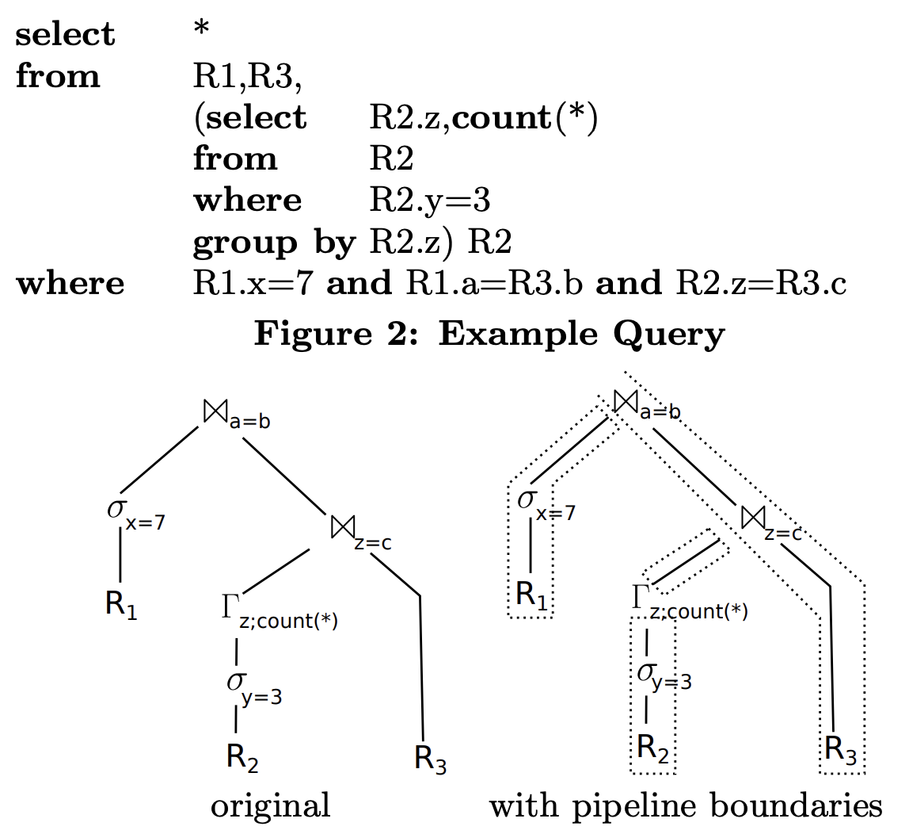

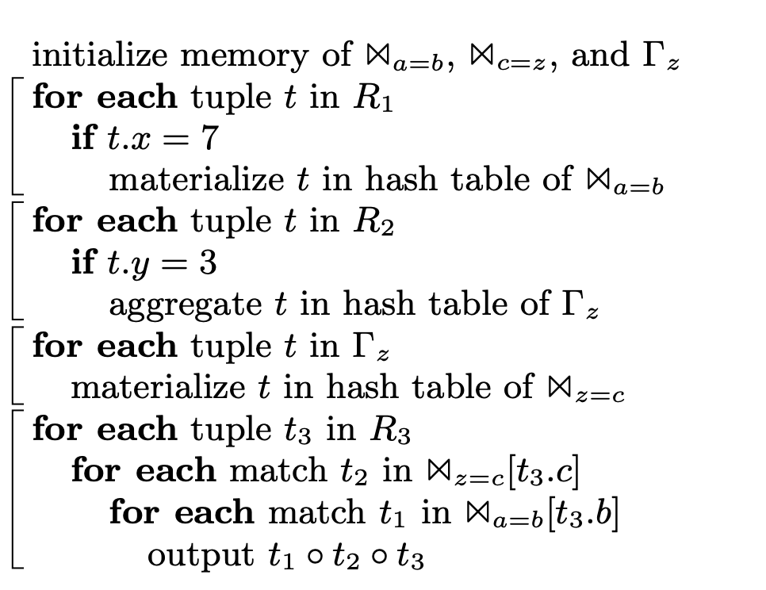

#### 对于表达式谓词计算的 AST 解释执行开销

传统的执行是从根节点开始递归地 eval()，有大量的指针间接寻址，对于 cache 极不友好。大量指令跳转导致 cpu pipeline 难以预测，无法充分利用指令级并行。另外对于操作列数据需要大量的类型转换与检查。codegen 可以将表达式生成平坦的代码，在二进制层面消除了大量无效指令。比如：

```sql
WHERE value < 9 AND value2 > 233 + ? AND y_string >= "abc" // 其中 "?" 表示用户参数
```

这里以 mysql 单行数据计算 `item->val()` 为例：

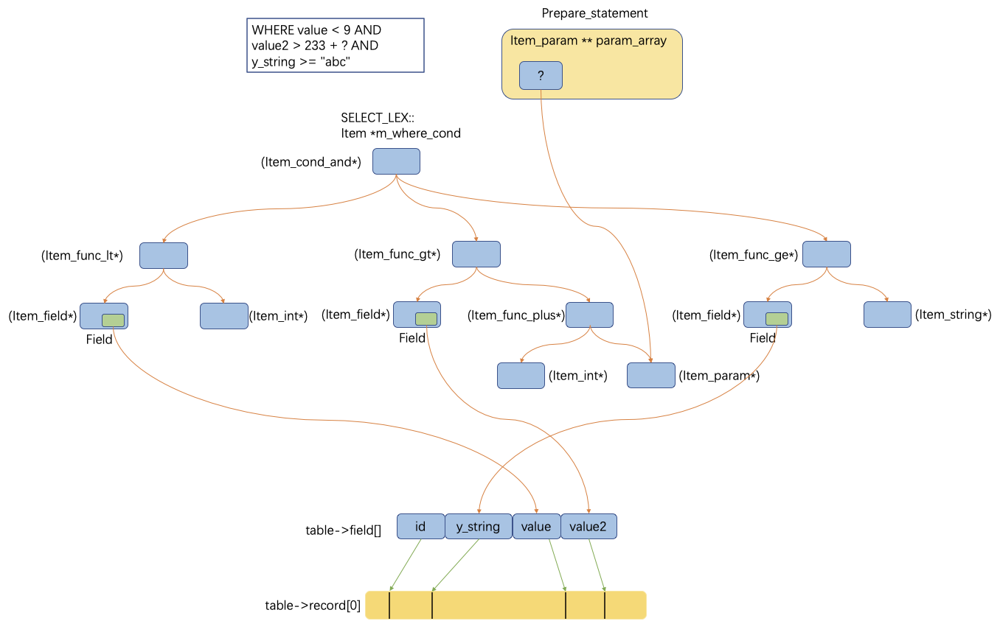

递归地进入根节点下面的每一个 cond，并根据每个 eval() 递归地计算

```c++
longlong Item_cond_and::val_int() {
  DBUG_ASSERT(fixed == 1);
  List_iterator_fast<Item> li(list);
  Item *item;
  null_value = false;
  while ((item = li++)) {
    if (!item->val_bool()) {
      if (ignore_unknown() || !(null_value = item->null_value))
        return 0;  // return false
    }
  }
  return null_value ? 0 : 1;
}

bool Item::val_bool() {
  switch (result_type()) {
    case INT_RESULT:
      return val_int() != 0;
    case DECIMAL_RESULT: {
      my_decimal decimal_value;
      my_decimal *val = val_decimal(&decimal_value);
      if (val) return !my_decimal_is_zero(val);
      return false;
    }
    case REAL_RESULT:
    case STRING_RESULT:
      return val_real() != 0.0;
    case ROW_RESULT:
    default:
      DBUG_ASSERT(0);
      return false;  // Wrong (but safe)
  }
}

longlong Item_func_lt::val_int() {
  DBUG_ASSERT(fixed == 1);
  int value = cmp.compare();
  return value < 0 && !null_value ? 1 : 0;
}

inline int compare() { return (this->*func)(); }

int Arg_comparator::compare_int_signed() {
  longlong val1 = (*left)->val_int();
  if (!(*left)->null_value) {
    longlong val2 = (*right)->val_int();
    if (!(*right)->null_value) {
      if (set_null) owner->null_value = false;
      if (val1 < val2) return -1;
      if (val1 == val2) return 0;
      return 1;
    }
  }
  if (set_null) owner->null_value = true;
  return -1;
}
```

对于 codegen，不再有间接寻址，无效指令，动态跳转。缓存友好，有效指令占比提升。

```c++
// 生成的代码
if((record_data$test_Y->get_value() < 9) &&
   (record_data$test_Y->get_value2() > (233 + param_0))) && // 其中 "param_0" 表示用户参数
   (record_data$test_Y->get_y_string() >= string_view("abc")) {
```

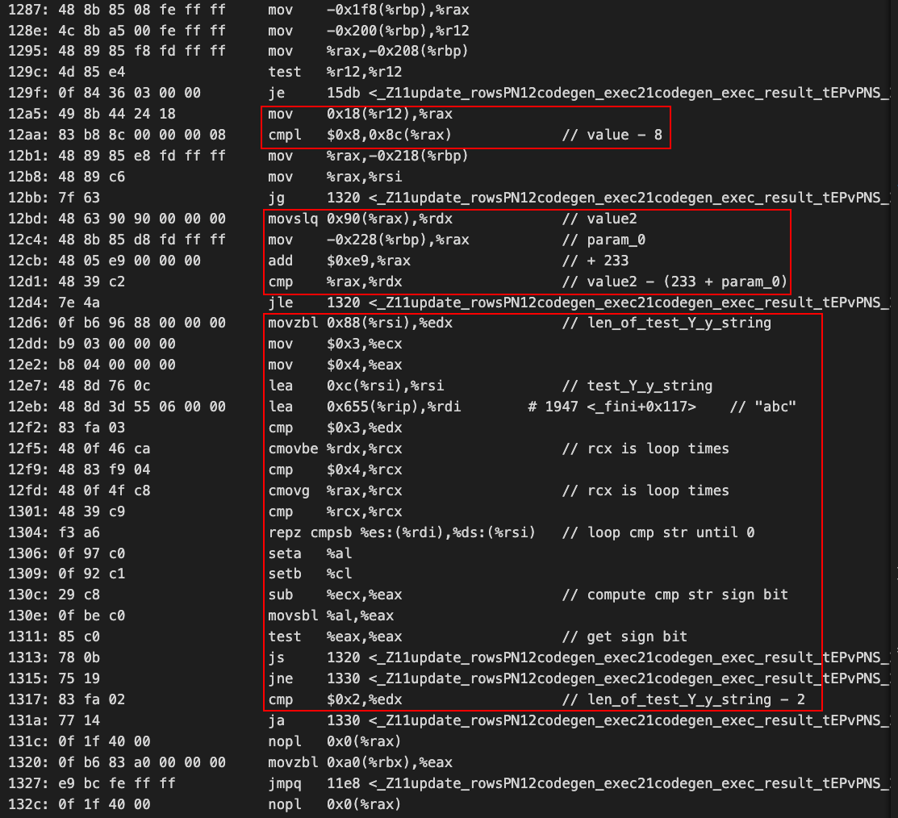

可以看出，红框部分指令就是真正执行的计算，消除无效跳转，把计算指令聚集到一起。

### Codegen 生成代码原理

有两个部分：Volcano-Iterator 和 expr eval

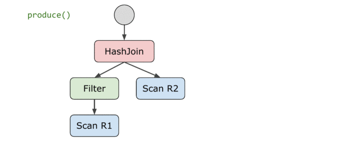

- 对于 Volcano-Iterator style query plan，对根节点调用 produce() 进行代码生成
- produce()：自上而下递归调用，生成对应初始化信息
- consume()：自底向上递归调用，生成对应的计算逻辑代码
  - 从一条 pipeline 的起点开始 visit 直到 breaker 节点终止

&nbsp;  
&nbsp;  

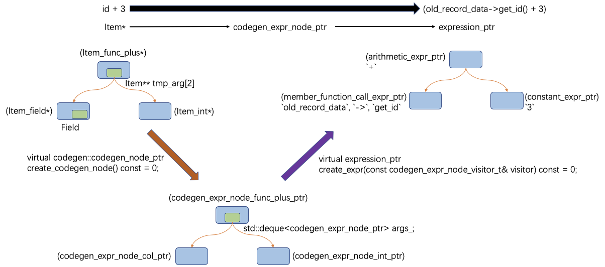

- 对于表达式计算，SQL expr 转换成某种 IR


&nbsp;  
<a id="2"></a>
## 业界实践

| 产品        | expression | whole stage     |
| :---          |    :----:   |          ---: |
| PostgreSQL   | LLVM        | 不支持       |
| ClickHouse   | LLVM        | 不支持      |
| Greenplum    | LLVM        | 不支持      |
| OpenGauss    | LLVM        | 不支持      |
| Spark        | Java        | Java       |
| Presto       | Java        | 部分,Java   |
| Impala       | LLVM        | 部分,LLVM   |
| SingleStore(MemSQL)        | C++,LLVM   | C++,LLVM      |
| Hekaton      | C++         | C++        |
| Hyper(Umbra) | C++,LLVM    | C++,LLVM   |

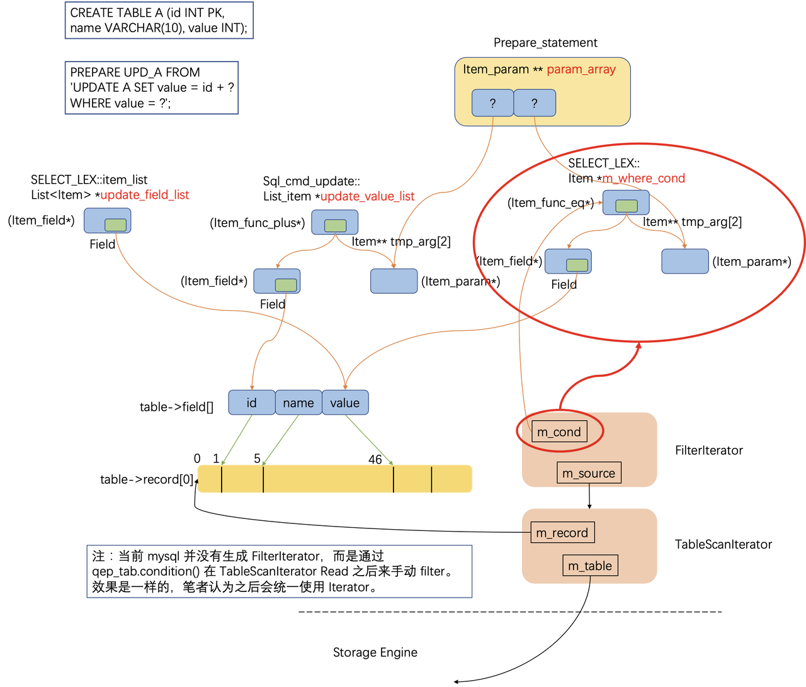

- Whole-stage level：整个语句级别的代码生成
- Expression level：仅红色圈部分的代码生成

> 这里不细讲了，随便拉几个凑数。。。  

### Clickhouse

仅支持编译谓词表达式，使用 LLVM IR。仅支持 INT/FLOAT 两种类型，函数层级编译，如果不支持某些表达式就退回解释执行。

执行时按照数据流将算子切分成 DAG pipeline，并通过 processor 调度 transformer 执行。

数据以 block 为单位处理，支持 SIMD 向量化

### PostgreSQL

参考 [WIP: Faster Expression Processing and Tuple Deforming (including JIT)](https://www.postgresql.org/message-id/20161206034955.bh33paeralxbtluv@alap3.anarazel.de)，认为批量执行不足以带来足够的收益，真正的瓶颈在于表达式计算以及行数据解析。PostgresSQL 引入 expression jit 之后，表达式计算加速了10倍，对 TPCH-Q01 行解析开销占比从 15% 下降到 3%。

### Hyper

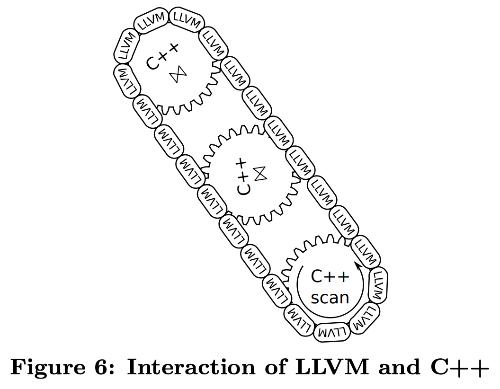

支持编译整个查询计划，使用 C++ 和 LLVM IR

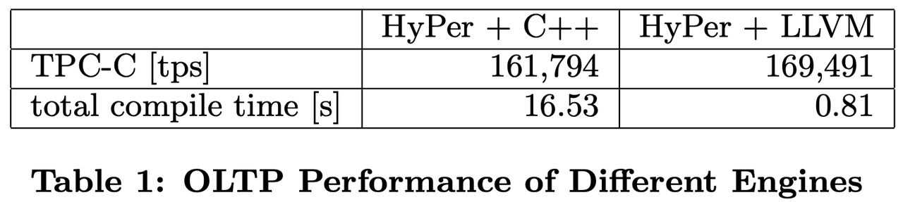

起初使用 C++ 编译，然后加载动态库执行。后来发现 C++ 编译很慢，并且不能人工优化底层寄存器使用，于是打算使用 LLVM IR + C++，对于 operator 的固定功能使用 C++ 实现，而 operator tree 和 expression 使用 LLVM IR 来衔接。

后续有 Umbra，这里不展开了，感兴趣可以看下。


&nbsp;  
<a id="3"></a>
## 与 pipeline 执行模型的结合

> 这里我们把 pipeline 定义成：将 plan 按照计算去切分得到的流式计算结构。后面可以再按数据去切分，得到更细粒度的 mpp task。  
> push-based 的真正优势在于：允许以更细粒度去切分计算和数据，在调度和利用并行性方面获得收益。  

由于 codegen 天然就是把执行控制流“拍平”了，和 pipeiline 的思路是如出一辙。因此我们可以考虑如何把这一套融合起来（包括所谓的 morsel-driven，vectorization 等等），首先思考一下会是什么形态：

- 支持混合粒度的 code generation
  - 传统的只支持 expr / whole-stage，这两种粒度显然太粗了不够灵活，我们需要在 pipeline 流程中的任意一段，或者任意计算算子，或者内部的某个谓词或者聚合表达式的粒度上支持 code generation
- 支持运行时自适应 code generation
  - 问题在于，如果判断需要做某种粒度上的 codegen，应该尽早做。判断的时机最早在优化器，当然也有可能运行时发现做 codegen 是有显著收益的。这里就需要一种方案，运行时可以非常自然地细粒度地替换代码。
  - 这里提供一个简单的方案：pipeline 的每个算子都包含一个函数指针来指导计算，运行时提交一个 codegen 任务，完成回调里直接替换函数指针即可
  - 这样比 Umbra morsel-driven 还要自适应细粒度了
- 判断收益
  - 估计数据规模和计算量
  - 估计编译本身的耗时

以如下查询为例：

```sql
SELECT A.value, B.value
FROM A JOIN B on A.id = B.id
WHERE A.value > 60 AND B.id > 100;
```

查询计划如下：

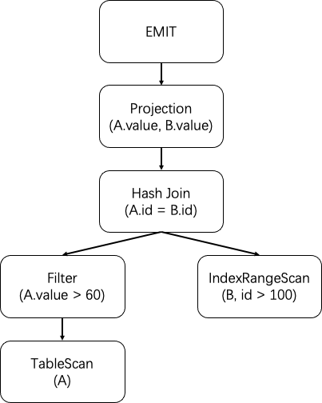

划分出的 pipeline 如下

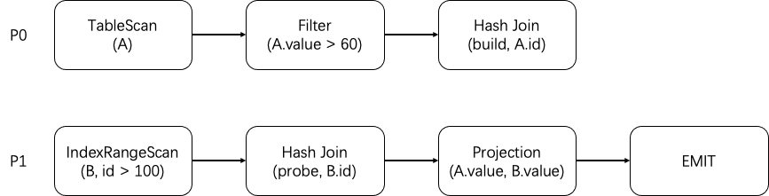

数据流计算过程如下：

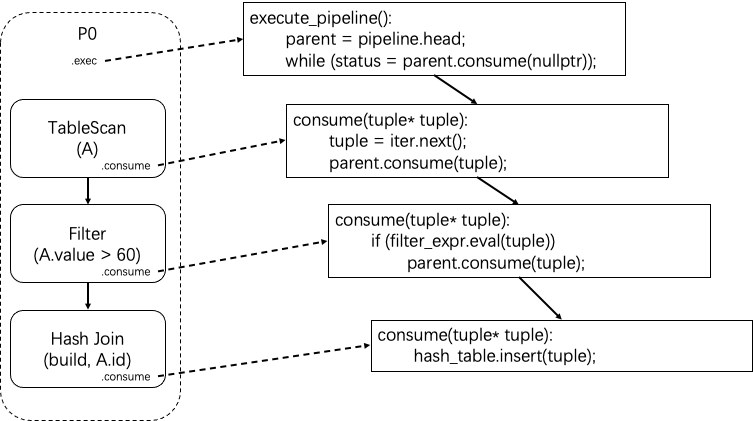

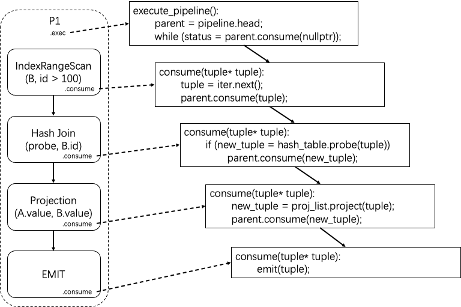

> 这里简化了控制流，比如其实 probe 可能超出 buffer，那么需要维护状态等。  

pipeline 的每个算子都包含一个函数指针来指导计算，这样就可以在运行时替换任意粒度的计算过程。并且利用 LLVM inline 功能还可以将多段编译好的代码再次融合。

### 与向量化结合

如果是生成 cpp code，可以考虑生成编译器自动向量化友好的代码。

如果是生成 LLVM IR，这里会有个问题：backend optimization 会倾向于 IR 具有某种模式，而通常 frontend 生成 IR 时也会遵循这种模式。所以这里生成 IR 也需要细致地考虑这种模式（领域强相关的知识），否则 backend 可能不会帮你做向量化，与不做 codegen 相比，质量甚至可能还回退了。

因此这里可能会产生一个跨领域的合作问题。


&nbsp;  
<a id="4"></a>
## 最后

1. 想清楚收益和成本是什么。（如果需要加速的计算链路只占 10%，那 codegen 的收益撑死也就是这么多）  
2. 技术上没什么难度，主要工程上融合进现有架构需要完善很多细节。  
