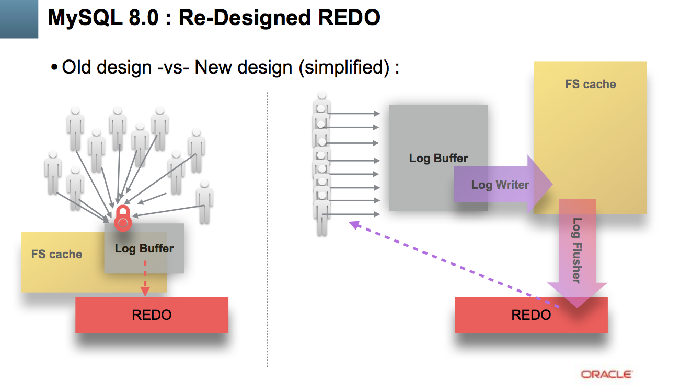

# 【管中窥豹】浅谈调度器演进的思考，从 CFS 到 EEVDF 有感

> 本文不要求读者了解 CFS/EEVDF，只是把这俩作为引子，探讨调度器质量维度的定义。随便写点啥，比较肤浅，甚至判断可能是存在偏差的。  
>   
> （这篇写着写着懵了，越来越扯，有点意识流了，感觉还是把握不住。。。。。）  

- CFS 问题
- 其他考虑
- EEVDF 讨论和演进
- 总结
- 参考


&nbsp;  
## CFS 问题

本文主要尝试研究 [1] Linux6.6 引入 EEVDF 前后演进的一些思考。

我们知道，调度器实际上定义了计算任务映射到底层硬件资源的抽象。那这样有个问题：我们对计算任务资源占用的预期和调度器的行为是否是对齐的？

最常见的场景，Linux 上用户态线程默认使用 CFS，而 CFS 暴露给用户侧的质量定义只有 `nice` 这唯一一个指标，含义也很简单，`nice` 实际上定义了**计算带宽份额**。那问题进一步变成了，我们能否通过计算带宽份额，将计算任务的调度行为描述得很清楚。为了解答这个问题，我们首先看看 real world 有什么样的质量预期：

### 案例1

我们关注 [2, 3] QoS 研究中的调度部分，其中描述一个场景：在线 memcached 集群与离线批处理任务混部。memcached 对延迟非常敏感，而文中指出 CFS 在这种场景下没法保证调度延迟，如下图所示：


可以看到 [4] FAIR_SLEEPER 会给出一个睡眠补偿 quota（基本就是 min_vrt），这样 B 会立刻（或稍后）抢占 A [29, 30]，并且至少运行一个 min granularity，导致 A 服务的延迟违反 SLA。SUSE 的测试 [5] 表明新唤醒的任务几乎总是会立即抢占正在运行的任务，[6] 建议根据队列深度自适应调整补偿 quota。文中提到了改进方案 BVT，大致思路是每次给 vrt 减一个 user specified value，让 task 的带宽在账面上削减一点，得到更多调度机会，而有测试 [7] 显示 BVT 效果无法达到预期。

观察：

1. CFS 定义计算带宽份额作为 QoS 的基准，但是工程上还包含很多启发式的策略，比如启动惩罚，睡眠补偿等。  
2. 在这个场景中，我们尤其要考虑不同负载对延迟的容忍程度存在较大差异，抢占策略也会明显影响调度质量。  

> 看完 EEVDF 回来的读者可能会有疑问：在 EEVDF 中不是还是会有调度到 B 导致至少 min granularity 内 A 无法服务么？答案是是的，但是由于 B 是 best effort，带宽权重要远远小于 A，都运行的情况下这本来就是极小概率事件；另一方面，由于 !0-lag placenment 导致 B 的 IO wait / signal 等事件不会频繁导致抢占，因为在 cfs->rq 中的加权偏移是继承的，于是 A 服务可以满足延迟 SLA。  

### 案例2

Heracles [8] 表明 CFS 无法有效处理 LC 和 BE 混部，导致违反延迟 SLA。简单方案是基于 core 的隔离，并且需要考虑 task 在 core 之间 migrate。

微软 Bing 搜索引擎的混部经验 [9, 10] 表明，基于现有 CFS 调度器或者对其进行魔改是不切实际的，因为综合质量可能发生不可预测的改变，更不用说内核维护了。而且 indexserver 需要 standalone 使用资源。于是这里在应用层提供了一种以 core 为粒度的组隔离，如下图所示：


primary / secondary 分别是 LC / BE。buffer 可配置大小，用来响应突发流量，如果空闲 core 多了，就可以出让带宽给 secondary，如果少了，就回收 secondary。

观察：

1. 常见的 LC + BE 的混部模式，CFS 缺乏手段来保证延迟 SLA。  
2. 以 core 为最小粒度的 QoS 方案来保证突发服务的响应时间。  

### 案例3

不说大规模混部场景，即使同一个服务内部也会有这种现象，[11] 考察调度对 InnoDB IO 性能的影响。 MySQL8.0 相关前置知识可以参考 REDO IO 模型设计 [12] 和 IO 模型演进分析 [13]。



从图中可以看到，这里从 mtr 写入 log，一直到完成回调，是全链路异步化的。其中写入 log 是由可扩展的事务线程完成，而后续的 IO 由两个线程分别完成。flush 线程的特征是，计算带宽消耗少，比如发射个 fsync 请求，但是需要及时响应事件，比如 IO 完成的下半部，就是去回调通知前台事务线程。异步链路各个环节的吞吐都要能匹配的上，并且 IO 控制线程的响应要及时，这样才能提高 tps。[11] 的实验结果表明，在 core 级别隔离 IO 线程和前台事务线程可以让 IO 线程调度更频繁，响应更及时（这里面有些打点数据还是有些说法的）。

观察：

1. CFS 无法区分延迟敏感程度，应用层采用绑核手段来保证调度延迟的可预测性。  

### 总结

很明显，以上案例都可以总结为两种负载混部：高优先级的低延迟任务和低优先级的批处理任务，前者针对延迟敏感，后者追求吞吐量最大化。而 CFS 无法通过计算带宽份额的差异满足这里的延迟要求差异。[14] 对混部场景下 CFS 的缺陷进行了非常详细的分析。


&nbsp;  
## 其他考虑

### 近数据

通俗的说，需要考虑将计算调度到靠近数据的节点。 不过我们这里举相反的例子：

FaceBook 的经验 [15] 表明，在计算资源不足的情况下，将计算任务绑定到靠近数据的高负载节点，不如利用稍微远的空闲计算节点，这对延迟敏感服务有显著的收益。

类似的情况还有 [16]，不过这里和拓扑结构是强相关的，也不好说。

另外还要考虑 [17] waker 与 wakee 虽然有数据相关性，但也会抢占计算资源，导致 waker 调度延迟不可控。

### 负载与能源效率

CFS 支持观测每个调度实体的负载 [18, 19]，这样的统计信息可以指导我们做一些能耗方面的优化。

比如 [20] 考虑能源成本模型和能源感知调度，[21] 指出 CFS 是面向性能的，没有考虑频率和能源效率，其中还提到了一个骚操作：不均衡调度将负载倾斜到 busy core，于是 idle core 就可以出让功率给 busy core，这样似乎可以节省能源，不过需要考虑调度质量和性能影响。

甚至我们还需要考虑计算资源是异构的 [22]，这就要求调度器评估不同计算负载的质量倾向。像 [23] ARM big.LITTLE 大小核的支持，Cortex-A7 可以跑非交互式的后台操作和流媒体解码，以提高电源效率，Cortex-A15 服务对响应延迟有要求的交互式应用，当然这两者并非是绑定的。还有更离谱的，万一某些产品的小核是 off-chip，在能耗收益之外还要考虑延迟和带宽的显著受损。

下图出自 [24] 《The Datacenter as a Computer - Designing Warehouse-Scale Machines》 3rd，可以明显看出负载和功耗是不成正比的，比如负载 100% 时功耗算作 100%，但是负载 30% 时功耗是 60%，从这个角度看调度器也是有文章可做的。


总之就是要综合考虑功率和性能质量 [25]。

### 趋势

- 能源效率：显而易见的，能源效率已经越来越成为数据中心基础设施（无论软硬件）设计空间的重要指标。调度器也要平衡考虑能源效率与性能质量
  - 能源效率这一目标怎么传导到基础设施层面呢？估计现在只在数据中心维护和高职级同学的 TCO 报告中出现，会以什么方式进入基础软件的质量考量？（有可能也不需要进入，在内核/虚拟化层面弄点简单策略就行？）
- 异构资源：调度器需要考虑多维度的资源，比如 cpu + memory。比如在分析型场景中，复杂查询对内存的要求可能远超过计算带宽，这时候就要考虑切分数据和任务，并且调度要考虑内存占用和 spill 的情况 [103]。


&nbsp;  
## EEVDF 讨论和演进

> 抛开实现感觉能谈的也不多，这里还是就实现相关细节随便扯扯。  

[26] 引入 cfs_rq->avg_vruntime 作为加权和（注意不是加权平均值 [27]）。[28] 用 avg_vruntime 取代 START_DEBIT 启发式方法，原来的 START_DEBIT 代表启动惩罚，避免新加入的影响当前调度周期。

FAIR_SLEEPERS 睡眠补偿机制会导致预期之外的抢占问题 [5]，这是因为被唤醒线程在 place_entity 中被赋予 cfs_rq->min_vrt，[29] 中 gran 是根据低带宽权重计算，而 curr 是在线服务带宽优先级高，就导致 diff 容易满足抢占条件。即使此时没有满足抢占条件，等到稍后 tick，[30] 比较 curr->vrt 和 cfs_rq->min_vrt，如果差值大于 ideal wall time，就可以抢占，这几乎必然发生。另外，说实话这些解释 [31, 32, 33] 我都不是很满意。

[34, 35] 初步考虑 lag-based placement。

[36, 37] 之前似乎没怎么考虑过 latency sensitive，因为 QoS 是单一的，就是计算带宽份额。

考虑将 latency sensitive 融合进 CFS：（注意相关 patch 很多未合入主线）

[38, 39, 40, 41, 42] 考虑引入 latency nice。[43, 44] 清晰地从两个维度定义质量：nice 表示带宽份额，latency nice 表示抢占策略。[45, 46, 47, 49, 50, 51] 讨论 latency nice 值的含义。里面还提到了 Oracle 希望牺牲延迟换吞吐，而 Facebook 希望牺牲吞吐换延迟。[52] 认为 latency nice 不应该影响带宽，这个时候还没有 deadline。应用可以通过 latency nice 定义延迟容忍度，比如 FB/Android 场景 [53]，预期有较低的调度延迟，并且不希望被不重要的后台任务频繁抢占。

[54] 基于 cfs_rq->avg_vrt 引入 se->lag，表示到 cfs_rq 加权平均的距离，进出 rq 或者 migrate 都会继承这个距离，注意这里还不是说加入后保持这个加权偏移，而是加入前带上的。

既然有了 latency nice 的思路，就开始考虑引入 EEVDF [55]（一种 WF2Q）。其实 [56] 2010 年就有 EEVDF 的第一个版本了，不过当时 [37] 认为只需要考虑带宽 quota。

CFS [57] 之前还尝试过一版 latency nice 的策略。[58] preempt 考虑 latency_nice，这里感觉应该是两个 patch 才对，因为最后变成了 preempt 的范围缩减了。应该是 1. preempt 考虑 se->vrt + C 定义带宽份额差距不到阈值不抢占；2. 将 C 改成 latency_nice 相关，允许延迟敏感负载积极抢占。[59] 额外维护一个 latency-rbt，太 hack 了，EEVDF 用 augmented-rbt 做比这个优雅太多了。[60] 有个详细案例分析。[61] 关注最后一个 test，一个是一直跑，另一个跑 1s 之后 sleep 1s。这里 CFS with latency_nice 是平分带宽，EEVDF 用 lag-based placement 我判断了下应该是 3:1，这里 CFS 带宽分配明显是有问题的。

[62] 引入 EEVDF，初版 pick_eevdf 实现按照 se->min_dl 选择下降 rbt，实现上有问题可能找到 right subtree 的 non-eligible set [63]，所以会出现 EEVDF 退化成 CFS（Zijlstra 后面表示10+年前写的时候感觉很机智hhh）。[64] fix 找到 eligible set 里真正 min_dl：按照 eligible 分成很多完整的 subtree，选其中 min_dl 最小的 subtree，再从 subtree 里选 se。注：eligible 就是小于 rq 加权平均的。

min_dl 是用 [65] augmented-rbtree 维护的，augmented-rbtree 逻辑就是在 rbtree 上加了一套回调，提供对 subtree 聚合计算的能力。笔者第一次看到时还惊了一下，没想到还有如此解法，这样就可以很自然地从 WFQ 演进到 WF2Q。注：min_heap 没法用侵入式实现，因为没法随机删除，还是要重新计算整条链路。

Abel Wu 提出了一些改进意见 [66, 67]，将 vrt 和 dl 颠倒了一下，rbt key 是 dl，augment 维护 min(vrt)，pick_eevdf 检查 min_vrt 判断下降，向左如果左边存在 eligible，否则向右。解决了 [64] 的 worst case：想像 min_dl 在靠右，但是不满足 eligible，然后又要回头去之前的 best_left，所以 worst 是 2 次树下降。这个方案实现很简洁（不过 vrt 就无序了），大概代码是：

```cpp
  /* Heap search for the EEVD entity */
  while (node) {
    struct sched_entity *se = __node_2_se(node);
    struct rb_node *left = node->rb_left;
    /*
     * Eligible entities in left subtree are always better
     * choices, since they have earlier deadlines.
     */
    if (left && vruntime_eligible(cfs_rq,
          __node_2_se(left)->min_vruntime)) {
      node = left;
      continue;
    }
    /*
     * The left subtree either is empty or has no eligible
     * entity, so check the current node since it is the one
     * with earliest deadline that might be eligible.     */
    if (entity_eligible(cfs_rq, se)) {
      best = se;
      break;
    }
    node = node->rb_right;
  }
```

lag 定义为 vrt 到 avg_vrt 的距离，[68, 69] migrate rq 时使用 [48] strategy #1 !0-lag 策略避免计算带宽份额公平性被破坏 [70, 71]。简单理解就是：[72] 希望加入后的 lag 为 se->vlag 能维持，可以简单计算下 $avg - se->vrt = /frac{se->load + cfs_rq->load}{cfs_rq->load}$

[73] 讨论 latency_nice 暴露给用户的语义，给绝对时间是不合适的，因为行为没法解释，而且用户也会乱写。[74] 分析 deadline 对 period 和 preemption 的影响。认为 EEVDF 比 CFS 更一致，并不尝试提供真正 deadline。认为应该给用户提供清晰的语义，减少用户犯错的机会。

[75, 76, 77] 展示了 EEVDF 调度器的详细图例，尤其注意 deadline 对 pick 的影响（想象一下和 CFS 的区别）。第二个图有点诡异，不太符合实现。

Peter 明确指出 [78, 79] EEVDF 的一个显著优势：之前的 WFQ 策略只定义了宏观维度的带宽份额，没有定义分配顺序，所以 CFS 实现上会包含大量启发式的策略。而 WF2Q 定义了 both：带宽份额和延迟目标。

关于质量问题，[80, 81, 82] 讨论 eligible set 的判断增加了 preempt 导致 context switch 变多，影响吞吐。Zijlstra 认为去掉 eligible 判断会导致 long deadline 推迟调度，开始调度后，很难被 preempt，可能出现延迟尖刺。EEVDF 考虑加权平均以前的，long deadline 被调度时，加权平均还不会太远，有 preempt 的机会。（笔者注：质量问题变化的原因非常复杂，有可能是某些启发式策略的微调或者参数调整这样的 low hanging fruit，剩下的就要大量 trace 然后分析各种资源利用和瓶颈）

[83, 84, 85, 86, 87] 考虑 sleep 场景带宽补偿，还提到了 cgroup 带宽分配，面对满载的和一个频繁 sleep 的，感觉也没说清楚。里面还提到租户可能利用此采取更激进的抢夺带宽的手段，不过我感觉是没毛病的，sleep 相当于是放弃带宽了，然后 !0-lag 表示再重新加入的时候给预期的带宽份额，没有补偿。strategy #1 !0-lag placement 策略有可能 [88] 鼓励租户空转直到被抢占，也不愿意退出再重进，因为被抢占后，vrt 和加权平均拉开差距了，而退出重进保留了 lag。因此租户可能会倾向于前者，这样可能获得更多的计算带宽。strategy #2 0-lag placement [89] 会破坏带宽 qos。另外 !0-lag 会有一个显著问题：如果一个较大的 lag sleep 然后 wake，在 EEVDF 里不是 eligible set，不会被调度；而之前的 CFS 策略会把他变成 min_vrt，很容易被调度。这里的差异会导致某些程序切换调度器后的行为破坏预期 [90]。

schbench [91] 显示 EEVDF 在唤醒延迟上有显著改进，但是整体延迟有损失。各种 sched benchmark [92] 表明有收益有回退。在 FB 网页服务器场景表现不佳 [93, 94]，相比 CFS 延迟和吞吐均有明显回退，分析了一堆主要就是 switch 次数多导致 locality 差（分析了不少，不过他只给了端到端数据，看不出来他咋判断的）。[95] 测试几款游戏的 FPS，《赛博朋克2077》 《大表哥2》 EEVDF 略优于 CFS，其他游戏 EEVDF 略逊于 CFS，基本上有来有回。

[96, 97] 将 latency nice 与 EEVDF 结合，只要把 dl 计算改为由 latency nice 计算即可。不过这个目前没有合入主线，主线中仍然采用的是用 nice 计算 deadline [98, 99]。

[100] 认为 slice 宽度影响抢占频率，[101] 判断 chromium 关键路径较长，对 involuntary context switch 容忍度较低，一次连贯的计算任务可能达到 3ms。对于 involuntary context switch 的问题，[102] 建议维持 curr，直到 curr 不再 eligible。这个我不好评价，感觉也挺危险的。


&nbsp;  
## 总结

面对上层不同类型的计算负载和资源利用模式，以及底层共享的异构资源时，我们首先要回答一个关键问题：“**如何定义调度器的质量？**”

对于 EEVDF，虽然说目前还没有将 latency nice 延迟敏感这一项作为调度器的质量指标暴露出去，但是相比 CFS 已经前进了一步了。首先是从 WFQ 框架过度到 WF2Q，这意味着多种质量指标纳入 QoS 考量成为可能。然后是采用了 EEVDF strategy #1 !0-lag placement 策略，这意味着 se 在进出或者 migrate rq 时能够保证带宽的公平性，并且*暂时*摆脱了 CFS 时期的一大坨启发式策略。另外在质量方面，目前年幼版的 EEVDF 和 CFS 基本上是有来有回，虽然很多场景的 wakeup latency 有明显改善，但是整体 latency & throuput 并不都是正收益，甚至有些关键场景出现不可接受的回退，还需要持续观察和打磨。


&nbsp;  
## 参考

- 1 [An EEVDF CPU scheduler for Linux](https://lwn.net/Articles/925371/)
- 2 [Reconciling high server utilization and sub-millisecond quality-of-service](https://dl.acm.org/doi/10.1145/2592798.2592821)
- 3 [(PPT) Reconciling high server utilization and sub-millisecond quality-of-service](https://jacob.leverich.org/papers/2014.mutilate.eurosys.slides.pdf)
- 4 [place_entity - v4.19.36](https://elixir.bootlin.com/linux/v4.19.36/source/kernel/sched/fair.c#L3795)
- 5 [CFS Performance Issues](https://lore.kernel.org/lkml/200905281502.22487.okir@suse.de/)
- 6 [[RFC][PATCH] sched: avoid huge bonus to sleepers on busy machines](https://lore.kernel.org/lkml/1262596842-17392-1-git-send-email-sjayaraman@suse.de/)
- 7 [cgroup cpu 调度之 Borrowed-virtual-time (BVT) scheduling](http://0fd.org/2018/04/14/borrowed-virtual-time-bvt-scheduling/)
- 8 [Heracles: improving resource efficiency at scale](https://dl.acm.org/doi/10.1145/2872887.2749475)
- 9 [PerfIso: Performance Isolation for Commercial Latency-Sensitive Services](https://www.usenix.org/conference/atc18/presentation/iorgulescu)
- 10 [(PPT) PerfIso: Performance Isolation for Commercial Latency-Sensitive Services](https://www.usenix.org/sites/default/files/conference/protected-files/atc18_slides_iorgulescu.pdf)
- 11 [【MySQL】MySQL 8.0 redo log写入性能问题分析](https://kernelmaker.github.io/MySQL_8_core)
- 12 [MySQL 8.0: New Lock free, scalable WAL design](https://dev.mysql.com/blog-archive/mysql-8-0-new-lock-free-scalable-wal-design/)
- 13 [MySQL Performance: 8.0 re-designed REDO log & ReadWrite Workloads Scalability](http://dimitrik.free.fr/blog/posts/mysql-performance-80-redesigned-redo-log-readwrite-workloads-scalability.html)
- 14 [混部之殇-论云原生资源隔离技术之CPU隔离(一)](https://cloud.tencent.com/developer/article/1821725)
- 15 [[PATCH RESEND] sched: prefer an idle cpu vs an idle sibling for BALANCE_WAKE](https://lore.kernel.org/lkml/1432761736-22093-1-git-send-email-jbacik@fb.com/)
- 16 [[tip: sched/core] sched/fair: Multi-LLC select_idle_sibling()](https://lore.kernel.org/lkml/168553468754.404.2298362895524875073.tip-bot2@tip-bot2/)
- 17 [[PATCH v3 1/2] sched: smart wake-affine foundation](https://lore.kernel.org/lkml/51D50057.9000809@linux.vnet.ibm.com/)
- 18 [per-entity load tracking](http://www.wowotech.net/process_management/PELT.html)
- 19 [PELT算法浅析](http://www.wowotech.net/process_management/pelt.html)
- 20 [[RFCv5 PATCH 00/46] sched: Energy cost model for energy-aware scheduling](https://lore.kernel.org/lkml/1436293469-25707-1-git-send-email-morten.rasmussen@arm.com/)
- 21 [[RFC v4 0/8] TurboSched: A scheduler for sustaining Turbo Frequencies for longer durations](https://lore.kernel.org/lkml/20190725070857.6639-1-parth@linux.ibm.com/)
- 22 [Hybrid scheduling gets more complicated](https://lwn.net/Articles/909611/)
- 23 [Linux support for ARM big.LITTLE](https://lwn.net/Articles/481055/)
- 24 [The Datacenter as a Computer - Designing Warehouse-Scale Machines 3rd 读书笔记](https://zhuanlan.zhihu.com/p/677779091)
- 25 [Re: [RFC PATCH 1/9] sched,cgroup: Add interface for latency-nice](https://lore.kernel.org/lkml/f4d28328-973c-4b94-334d-a68c958f6cc4@linux.ibm.com/)
- 26 [[PATCH 06/10] sched/fair: Add avg_vruntime](https://lore.kernel.org/lkml/20230306141502.569748782@infradead.org/)
- 27 [Re: [PATCH 01/15] sched/fair: Add avg_vruntime](https://lore.kernel.org/lkml/20231011073001.GI14330@noisy.programming.kicks-ass.net/)
- 28 [[PATCH 07/10] sched/fair: Remove START_DEBIT](https://lore.kernel.org/lkml/20230306141502.630872931@infradead.org/)
- 29 [wakeup_preempt_entity - v4.19.36](https://elixir.bootlin.com/linux/v4.19.36/source/kernel/sched/fair.c#L6510)
- 30 [check_preempt_tick - v4.19.36](https://elixir.bootlin.com/linux/v4.19.36/source/kernel/sched/fair.c#L4043)
- 31 [Re: [PATCH]sched: convert wall-time to vruntime for check_preempt_tick](https://lore.kernel.org/lkml/1302240665.7551.48.camel@marge.simson.net/)
- 32 [[PATCH] sched: Buggy comparison in check_preempt_tick](https://lore.kernel.org/lkml/1293348184.6942.72.camel@marge.simson.net/)
- 33 [Re: [RFC PATCH] check_preempt_tick should not compare vruntime with wall time](https://lore.kernel.org/lkml/1284430252.7386.4.camel@marge.simson.net/)
- 34 [Re: [RFC patch] CFS fix place entity spread issue (v2)](https://lore.kernel.org/lkml/1271688226.1488.238.camel@laptop/)
- 35 [Re: [PATCH 1/2] sched: normalize sleeper's vruntime during group change](https://lore.kernel.org/lkml/AANLkTikVQist_VnCcpZzU78t0TVuocwOcDPG4POVzSdv@mail.gmail.com/)
- 36 [Re: [RFC patch 1/2] sched: dynamically adapt granularity with nr_running](https://lore.kernel.org/lkml/AANLkTimmkmeyFg6wSw4Ej=gqLAHgcB5puRxvAa_14eZp@mail.gmail.com/)
- 37 [Re: [RFC patch 1/2] sched: dynamically adapt granularity with nr_running](https://lore.kernel.org/lkml/1284374728.2275.159.camel@laptop/)
- 38 [Latency_nice - Implementation and Use-case for Scheduler Optimization.ppt](https://static.lwn.net/images/conf/2020/ospm/latency-nice-slides.pdf)
- 39 [Improved response times with latency nice](https://lwn.net/Articles/887842/)
- 40 [[PATCH 0/6]  Add latency_nice priority](https://lore.kernel.org/lkml/20220311161406.23497-1-vincent.guittot@linaro.org/)
- 41 [[PATCH v6 0/9] Add latency priority for CFS class](https://lore.kernel.org/lkml/20221028073637.31195-1-vincent.guittot@linaro.org/)
- 42 [[RFC PATCH 0/9] Task latency-nice](https://lore.kernel.org/lkml/20190830174944.21741-1-subhra.mazumdar@oracle.com/)
- 43 [Re: [RFC 5/6] sched/fair: Take into account latency nice at wakeup](https://lore.kernel.org/lkml/CAKfTPtD0kFuyh+Q3po0UHR3GQz1uKGxRrFWDfsHcCuQr4ZWbNQ@mail.gmail.com/)
- 44 [Re: [RFC 5/6] sched/fair: Take into account latency nice at wakeup](https://lore.kernel.org/lkml/CAKfTPtD2Hb_ZU8x1J9B6he7fYNvw2AyUBOKdfRk6zcSvJEvYTg@mail.gmail.com/)
- 45 [Re: [RFC 6/6] sched/fair: Add sched group latency support](https://lore.kernel.org/lkml/7139641b-5ca6-3799-9e41-72af894d02ad@oracle.com/)
- 46 [Re: [RFC 6/6] sched/fair: Add sched group latency support](https://lore.kernel.org/lkml/3c3a86fb2ead653318ecbaf2c999f6088c6eca4f.camel@linux.intel.com/)
- 47 [Re: [PATCH 0/6] Add latency_nice priority](https://lore.kernel.org/lkml/CAKfTPtBP0JL7XVhmzBh=UncbNi1A5Qv7BURQAmyinH-PwVHFWA@mail.gmail.com/)
- 48 [Earliest Eligible Virtual Deadline First : A Flexible and Accurate Mechanism for Proportional Share Resource Allocation](https://dl.acm.org/doi/10.5555/890606)
- 49 [Re: [RFC PATCH 1/9] sched,cgroup: Add interface for latency-nice](https://lore.kernel.org/lkml/20190905104616.GD2332@hirez.programming.kicks-ass.net/)
- 50 [Re: [RFC PATCH 1/9] sched,cgroup: Add interface for latency-nice](https://lore.kernel.org/lkml/20190905114030.GL2349@hirez.programming.kicks-ass.net/)
- 51 [Re: [RFC PATCH 1/9] sched,cgroup: Add interface for latency-nice](https://lore.kernel.org/lkml/df69627e-8aa0-e2cb-044e-fb392f34efa5@arm.com/)
- 52 [Re: [RFC PATCH 1/9] sched,cgroup: Add interface for latency-nice](https://lore.kernel.org/lkml/20190905114709.GM2349@hirez.programming.kicks-ass.net/)
- 53 [Re: [RFC PATCH 1/9] sched,cgroup: Add interface for latency-nice](https://lore.kernel.org/lkml/87imq72dpc.fsf@arm.com/)
- 54 [[PATCH 08/10] sched/fair: Add lag based placement](https://lore.kernel.org/lkml/20230306141502.691294694@infradead.org/)
- 55 [[PATCH 00/10] sched: EEVDF using latency-nice](https://lore.kernel.org/lkml/20230306132521.968182689@infradead.org/)
- 56 [Re: [RFC patch 1/2] sched: dynamically adapt granularity with nr_running](https://lore.kernel.org/lkml/1284371756.2275.108.camel@laptop/)
- 57 [[PATCH v6 0/9] Add latency priority for CFS class](https://lore.kernel.org/lkml/20221028073637.31195-1-vincent.guittot@linaro.org/)
- 58 [[PATCH v6 5/9] sched/fair: Take into account latency priority at wakeup](https://lore.kernel.org/lkml/20221028073637.31195-6-vincent.guittot@linaro.org/)
- 59 [[PATCH v6 8/9] sched/fair: Add latency list](https://lore.kernel.org/lkml/20221028073637.31195-9-vincent.guittot@linaro.org/)
- 60 [Re: [PATCH v5 7/7] sched/fair: Add latency list](https://lore.kernel.org/lkml/CAKfTPtCb4mxCJnX4JpYY7_3r-ZCHpT4j-4h+YcJyHcMLU7S1Vw@mail.gmail.com/)
- 61 [Re: [PATCH v5 7/7] sched/fair: Add latency list](https://lore.kernel.org/lkml/CA+q576N+NeKPTn7Ekw1rOcnA4+4PkGrw1mHD33SYTh=eAdHpsw@mail.gmail.com/)
- 62 [[PATCH 05/15] sched/fair: Implement an EEVDF like policy](https://lore.kernel.org/lkml/20230531124603.931005524@infradead.org/)
- 63 [Re: [PATCH 05/15] sched/fair: Implement an EEVDF like policy](https://lore.kernel.org/lkml/xm265y3sodyo.fsf@google.com/)
- 64 [[PATCH] sched/fair: fix pick_eevdf to always find the correct se](https://lore.kernel.org/lkml/xm261qego72d.fsf_-_@google.com/)
- 65 [Support for Augmented rbtrees](https://github.com/torvalds/linux/blob/master/Documentation/core-api/rbtree.rst#support-for-augmented-rbtrees)
- 66 [Re: Re: [PATCH 05/15] sched/fair: Implement an EEVDF like policy](https://lore.kernel.org/lkml/bdddc6f5-5e17-445b-bd86-dc14a8d17866@bytedance.com/)
- 67 [[PATCH 2/4] sched/eevdf: Sort the rbtree by virtual deadline](https://lore.kernel.org/lkml/20231107090510.71322-3-wuyun.abel@bytedance.com/)
- 68 [[PATCH 03/15] sched/fair: Add lag based placement](https://lore.kernel.org/lkml/20230531124603.794929315@infradead.org/)
- 69 [[PATCH 07/15] sched/smp: Use lag to simplify cross-runqueue placement](https://lore.kernel.org/lkml/20230531124604.068911180@infradead.org/)
- 70 [Re: [PATCH 11/15] sched/eevdf: Better handle mixed slice length](https://lore.kernel.org/lkml/CAKfTPtCnEdPpZSu3=t4tTEm-nWEwkyTwQuTLngcgABhcMGWvZA@mail.gmail.com/)
- 71 [Re: [PATCH 03/15] sched/fair: Add lag based placement](https://lore.kernel.org/lkml/20231013143414.GA36211@noisy.programming.kicks-ass.net/)
- 72 [Re: Re: EEVDF/vhost regression (bisected to 86bfbb7ce4f6 sched/fair: Add lag based placement)](https://lore.kernel.org/lkml/20231120105606.GQ8262@noisy.programming.kicks-ass.net/)
- 73 [Re: [RFC][PATCH 15/15] sched/eevdf: Use sched_attr::sched_runtime to set request/slice](https://lore.kernel.org/lkml/CAKfTPtCTe7pc=fahynt1kTffUXk5B18usEE_Ay40vE-yjVt0=A@mail.gmail.com/)
- 74 [Re: [RFC][PATCH 15/15] sched/eevdf: Use sched_attr::sched_runtime to set request/slice](https://lore.kernel.org/lkml/20230608115258.GJ998233@hirez.programming.kicks-ass.net/)
- 75 [Re: [PATCH 08/17] sched/fair: Implement an EEVDF like policy](https://lore.kernel.org/lkml/20230330080145.GA117836@hirez.programming.kicks-ass.net/)
- 76 [Re: [PATCH 08/17] sched/fair: Implement an EEVDF like policy](https://lore.kernel.org/lkml/CAKfTPtD+EiB4mnRD0z4wYg6PDn1vLKxu4fxrgfiqsm2G3+RrEQ@mail.gmail.com/)
- 77 [[PATCH 2/2] sched/eevdf: Use sched_attr::sched_runtime to set request/slice suggestion](https://lore.kernel.org/lkml/20230915124822.956946622@noisy.programming.kicks-ass.net/)
- 78 [Re: [PATCH 00/10] sched: EEVDF using latency-nice](https://lore.kernel.org/lkml/20230307130800.GD2017917@hirez.programming.kicks-ass.net/)
- 79 [Re: [PATCH 08/17] sched/fair: Implement an EEVDF like policy](https://lore.kernel.org/lkml/20230404120054.GV4253@hirez.programming.kicks-ass.net/)
- 80 [Re: [PATCH 00/15] sched: EEVDF and latency-nice and/or slice-attr](https://lore.kernel.org/lkml/dlbtvvm5cewqzh5bcpl4cqhcwxmnnjb6pdle5jzywiiznlactd@cmhnpim42m3p/)
- 81 [Re: [PATCH 00/15] sched: EEVDF and latency-nice and/or slice-attr](https://lore.kernel.org/lkml/CA+q576MS0-MV1Oy-eecvmYpvNT3tqxD8syzrpxQ-Zk310hvRbw@mail.gmail.com/)
- 82 [Re: [PATCH 00/15] sched: EEVDF and latency-nice and/or slice-attr](https://lore.kernel.org/lkml/20231005120557.GA743@noisy.programming.kicks-ass.net/)
- 83 [Re: [PATCH 14/17] sched/eevdf: Better handle mixed slice length](https://lore.kernel.org/lkml/20230404092936.GD284733@hirez.programming.kicks-ass.net/)
- 84 [Re: [PATCH 14/17] sched/eevdf: Better handle mixed slice length](https://lore.kernel.org/lkml/20230404135050.GA471948@google.com/)
- 85 [Re: [PATCH 14/17] sched/eevdf: Better handle mixed slice length](https://lore.kernel.org/lkml/20230405083543.GZ4253@hirez.programming.kicks-ass.net/)
- 86 [Re: [PATCH 14/17] sched/eevdf: Better handle mixed slice length](https://lore.kernel.org/lkml/CAEXW_YQmG83_Yb9JgXapt9RgAs4m=fHnrOKRqfG9N_VMYcA88A@mail.gmail.com/)
- 87 [Re: [PATCH 14/17] sched/eevdf: Better handle mixed slice length](https://lore.kernel.org/lkml/A0A2A612-B872-477E-A3B6-A1792EDF691E@joelfernandes.org/)
- 88 [Re: [PATCH 03/15] sched/fair: Add lag based placement](https://lore.kernel.org/lkml/xm26fs2fhcu7.fsf@bsegall-linux.svl.corp.google.com/)
- 89 [Re: [PATCH 11/15] sched/eevdf: Better handle mixed slice length](https://lore.kernel.org/lkml/CAKfTPtCnEdPpZSu3=t4tTEm-nWEwkyTwQuTLngcgABhcMGWvZA@mail.gmail.com/)
- 90 [Re: Re: Re: EEVDF/vhost regression (bisected to 86bfbb7ce4f6 sched/fair: Add lag based placement)](https://lore.kernel.org/lkml/ZZv09bLJvA5M%2Fkc7@DESKTOP-2CCOB1S./)
- 91 [schbench v1.0](https://lore.kernel.org/all/bc85a40c-1ea0-9b57-6ba3-b920c436a02c@meta.com/)
- 92 [Re: [PATCH 00/17] sched: EEVDF using latency-nice](https://lore.kernel.org/lkml/a79014e6-ea83-b316-1e12-2ae056bda6fa@linux.vnet.ibm.com/)
- 93 [Re: [PATCH 00/17] sched: EEVDF using latency-nice](https://lore.kernel.org/lkml/20230410031350.GA49280@maniforge/)
- 94 [Re: [PATCH 00/17] sched: EEVDF using latency-nice](https://lore.kernel.org/lkml/20230411020945.GA65214@maniforge/)
- 95 [Linux 6.6 with EEVDF the New CPU Scheduler | Gaming Comparison](https://www.youtube.com/watch?v=KgwbHRG7Q3s&ab_channel=Faugus%7CLinuxGaming)
- 96 [[RFC][PATCH 12/15] sched: Introduce latency-nice as a per-task attribute](https://lore.kernel.org/lkml/20230531124604.410388887@infradead.org/)
- 97 [[RFC][PATCH 13/15] sched/fair: Implement latency-nice](https://lore.kernel.org/lkml/20230531124604.477939524@infradead.org/)
- 98 [Re: [PATCH 00/15] sched: EEVDF and latency-nice and/or slice-attr](https://lore.kernel.org/lkml/20231002184136.GA1539@noisy.programming.kicks-ass.net/)
- 99 [Re: [PATCH 00/15] sched: EEVDF and latency-nice and/or slice-attr](https://lore.kernel.org/lkml/CA+q576MLvCwH2YQFx3V2tf3f4n6JUze7jkpqqTx97UPsOHewhg@mail.gmail.com/)
- 100 [Re: [PATCH 00/15] sched: EEVDF and latency-nice and/or slice-attr](https://lore.kernel.org/lkml/CA+q576Mov1jpdfZhPBoy_hiVh3xSWuJjXdP3nS4zfpqfOXtq7Q@mail.gmail.com/)
- 101 [Re: [PATCH 00/15] sched: EEVDF and latency-nice and/or slice-attr](https://lore.kernel.org/lkml/20231016165019.GG33217@noisy.programming.kicks-ass.net/)
- 102 [[tip: sched/core] sched/eevdf: Curb wakeup-preemption](https://lore.kernel.org/lkml/169228500414.27769.13366308319134164264.tip-bot2@tip-bot2/)
- 103 [[Design] Recoverable Grouped Execution](https://github.com/prestodb/presto/issues/12124)
