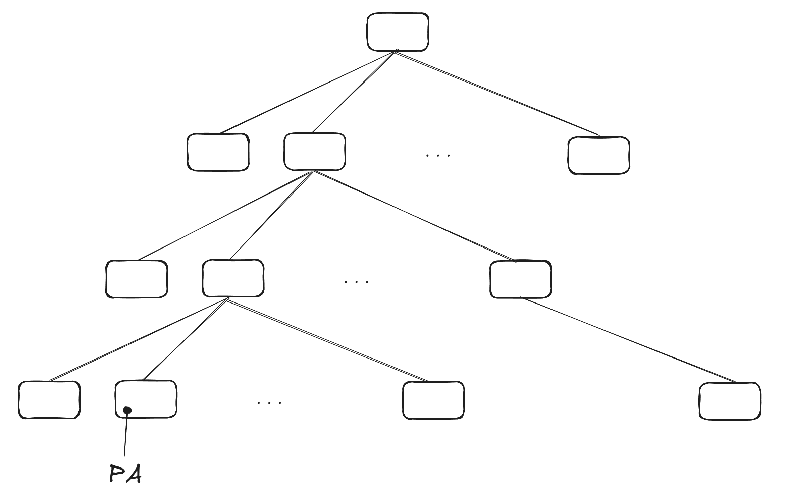
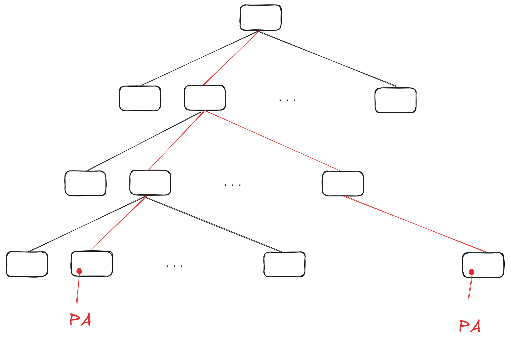
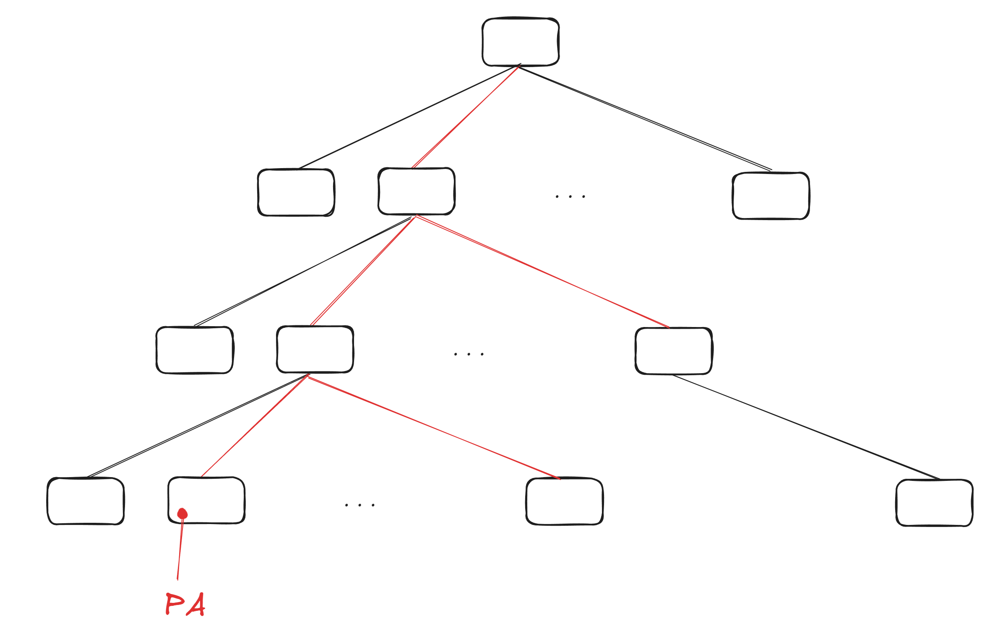
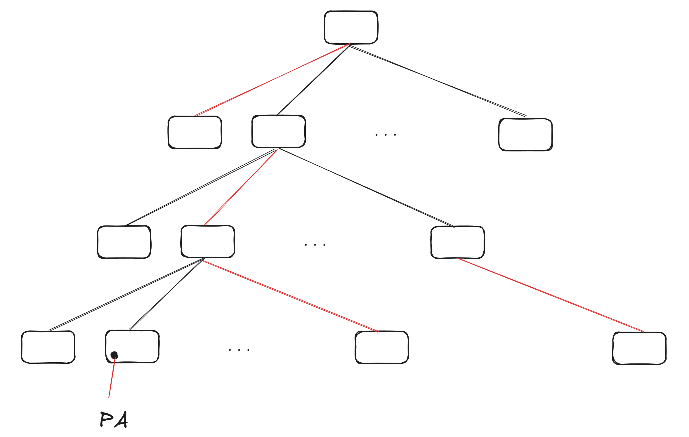
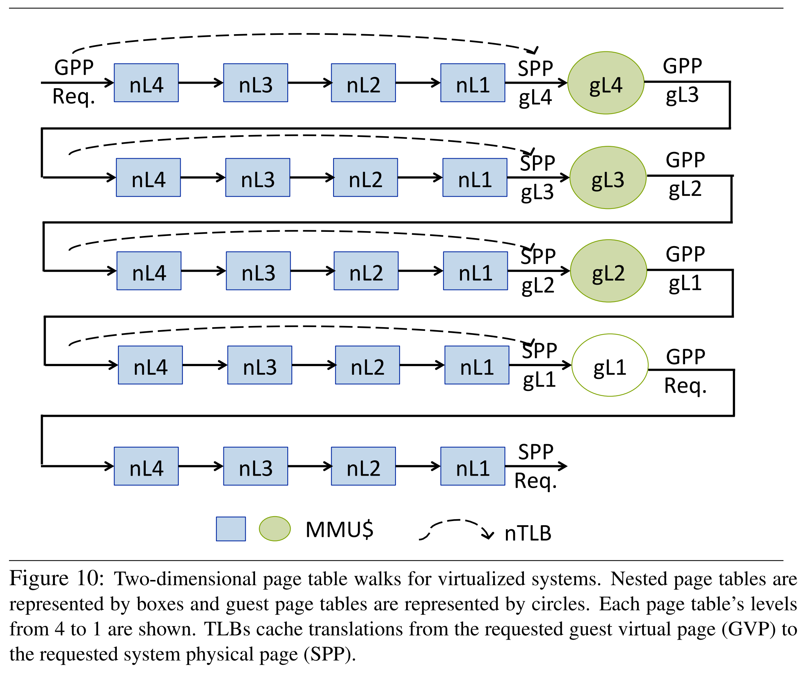

# 【管中窥豹】 page table cache 的两种方案

> 不知道多久以前写的，简单整理一下。之后考虑补充点虚拟化的方案。  

一般我们说 page table 是一个 radix 的结构，硬件想要翻译 VA -> PA 只要下降搜索就行了，找不到或者有啥问题就 page fault。

从上图看，1 次翻译过程从 CR3 算起需要 4 次物理地址访问，还有可能 cache miss，导致热数据的访问延迟至少是若干次 cache 访问延迟，因此需要为热数据设计 fast path。最简单的思路就是搞个缓存。

如图所示，传统的 TLB 方案（红色部分）：缓存整个 VA -> PA，不需要 walk page table 了，直接从 tlb 中得到 PA。但是由于存储空间和查询效率的限制，导致 tlb 容量极小，一旦没命中，就是完全 slow path，质量抖动差异巨大，那有没有平稳一点的方案呢？

查阅了一些资料，找到 Intel Paging Structure Cache 和 AMD Page Walk Cache 这两种方案。

&nbsp;  

- Intel Paging Structure Cache
  - 索引使用部分虚拟地址，从最高位起，可以一次跳过好几层（极端情况就是长到 VPN，那么就变成 TLB）
  - partial prefix VA -> pte of some level，红色部分表示从根节点起连贯到某一层的映射

存储上做点整合就是 translation path cache

&nbsp;  

- AMD Page Walk Cache
  - 索引使用物理地址 + 对应虚拟位的偏移，每次只能跳一层
  - (pte PA + level_i_offset(VA)) -> pte of some level
  - 不需要是连贯的 prefix VA

&nbsp;  

比较一下：

- A 方案需要多次单步查找，增加延迟和能耗；I 方案可以任意跨度搜索，同时支持并行搜索
- 覆盖范围上，I 方案通常更大，因为下降搜索的访问模式决定了部分前缀的高效利用
- I 方案存储空间更小，能效比更高；额外需要考虑存储上是 unified/split

&nbsp;  

考虑负载的内存访问模式：

- 比如密集还是稀疏
  - 对 upper/lower 的 reuse 程度
  - upper/lower 的 replacement 策略差异
- 我感觉密集的访问模式，是不是 A 方案在存储空间上有些优势？

&nbsp;  

测试主要都是针对 translation path cache 的不同存储方案，没找到 A 和 I 对比的，就不放了。

&nbsp;  

虚拟化 2D walk

## Reference

- [Translation caching: skip, don't walk (the page table)](https://dl.acm.org/doi/10.1145/1816038.1815970)
- [TLBs, Paging-Structure Caches, and Their Invalidation](https://kib.kiev.ua/x86docs/Intel/WhitePapers/317080-002.pdf)
- [Appendix L: Advanced Concepts on Address Translation](https://www.cs.yale.edu/homes/abhishek/abhishek-appendix-l.pdf) 非常详细
- [Accelerating two-dimensional page walks for virtualized systems](https://dl.acm.org/doi/10.1145/1346281.1346286) AMD 虚拟化 2D page walk
- [Every walk’s a hit: making page walks single-access cache hits](https://dl.acm.org/doi/10.1145/3503222.3507718) 中间 merge 一下，叫 flatten，虚拟化有收益
- [致敬 hacker ｜盘点内存虚拟化探索之路](https://mp.weixin.qq.com/s/f_bgSfz4nzG50izBYYzdLA)
- [Malicious Management Unit: Why Stopping Cache Attacks in Software is Harder Than You Think](https://www.usenix.org/conference/usenixsecurity18/presentation/van-schaik) 意料之中
