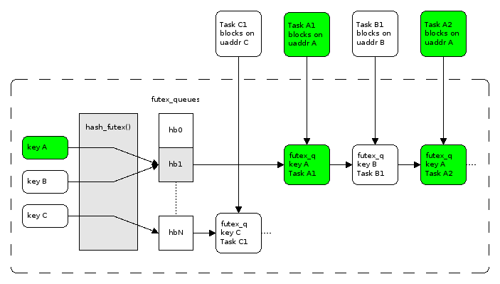

# 谈谈并发

- [基于系统调用的](#sys_call)
  - [futex: fast userspace mutex](#futex)
  - [mutex](#mutex)
  - [conditional_varialble](#cond_var)
  - [promise & future](#future)
  - [其他](#other)
- [不基于系统调用的](#atomic)
  - [happens-before](#happens_before)
  - [ISA 提供的 basic primitive](#isa)
  - [用户需求与解决方案](#requirement)
  - [直接寻址](#direct_access)
  - [间接寻址](#indirect_access)
  - [容器寻址](#container_access)
- [并发设计要点](#conclusion)
- [Reference](#reference)

&nbsp;   
<a id="sys_call"></a>
## 基于系统调用的

- pthread / futex
- 其他：socket, file locking, signal

<a id="futex"></a>
### futex: fast userspace mutex

IBM 2002 引入 futex：[Fuss, Futexes and Furwocks: Fast Userlevel Locking in Linux](https://www.kernel.org/doc/ols/2002/ols2002-pages-479-495.pdf)，2003 加入 kernel，目标是在共享内存的场景下提供一种高效的线程间同步机制。

<p/>

简单来说可以理解成内核为用户层维护的等待队列，主要提供等待-唤醒机制

- *uaddr：futex_word 由用户指定其表达何种含义
- Wait(*uaddr, val)：若 addr 仍是 val，则加入等待队列
  - 整个操作从比较到加入等待队列保证原子，与同一个 futex_word 上其他 futex_op 有全序
- Wake(*uaddr, val)：通知 val 数量的线程
- 其他：Requeue, PI, Robust

<a id="mutex"></a>
### mutex

#### 使用场景

<p/>

- 共享资源的互斥
- unlock operation **synchronizes-with** subsequent lock operations

<p/>

- 细粒度互斥（读写）

<p/>

<p/>

- 多级，有层次的互斥设计

<p/>

- 平等，要求 txn
  - 死锁预防，检测
  - `std::scoped_lock`（不推荐）

#### 内部实现思路

mutex 参考 [Futexes Are Tricky](https://akkadia.org/drepper/futex.pdf)

*uaddr 含义

- 0：锁未被持有
- 1：锁被持有，但无等待者
- 2：锁被持有，有等待者

```c++
void lock() {
  int val;
  if ((val = cmpxchg(uaddr, 0, 1)) != 0) {
    if (val != 2)
      val = xchg(uaddr, 2);
    while (val != 0) {
      futex_wait(&uaddr, 2);
      val = xchg(uaddr, 2);
    }
  }
}

void unlock(){
  if (atomic_dec(uaddr) != 1) {
    uaddr = 0;
    futex_wake(&uaddr, 1);
  }
}
```

可以看出，将“锁被持有”分割成两种状态的意义是：减少 `unlock()` 时非必需的 `futex_wake()` 系统调用开销。   
对应的，`lock()` 会相应的绕一点。   

<a id="cond_var"></a>
### conditional_varialble

#### 使用场景

<p/>

> 这里假设资源池空间无限，生产者永远可以放进去。   
> 否则空间也变成一种资源，生产者消费者同时又拥有相反的角色。   

- 为等待共享资源提供等待队列
- 持续性的生产消费模型
  - 最好是生产消费数量都是1
  - 如果不是1推荐用 semaphore

#### 常见用法

```c++
// consumer
{
  mutex.lock();
  while(!pred())
    cv.wait(&mutex);
  // consume
  // ...
  mutex.unlock();
}

// producer
{
  mutex.lock();
  // produce
  // ...
  cv.notify();
  mutex.unlock();
}
```

- `wait()` 与 `notify()` 语义上保证是原子的，并且是串行化的，即所有线程看到的 cv 状态是顺序一致的
- `wait()`：释放锁并等待、被唤醒、持有锁
- `notify()`：唤醒等待的线程

<p/>

- `wait()` 保证“释放锁”和“加入等待队列”是原子的
  - 为了保证 “check predicate” 有效性延迟至进入等待队列
  - `wait()` 一开始先拿 cv mutex lock
  - 有3个 futex，适合生产消费临界区外有 IO 的场景。若临界区外的操作比较轻，那应该重新考虑轻量级的同步机制
- 虚假唤醒 (spurious wakeup)
  - 由于 kernel 自身实现原因的唤醒，直到 linux 2.6.22
  - 由于 pthread 自身实现原因，唤醒后与持有锁两个动作并非原子，所以仍然需要检查 predicate 是否被满足
  - 综上，总是使用 while-loop 来检查 predicate，并 wait

<p/>

<p/>

<p/>

<p/>

- `notify()` 操作并非要求持有锁
  - 位于临界区内（推荐）
      - wait morphing：从条件变量队列转移到互斥队列（主流实现没有这样做的），减少线程切换开销
  - 位于临界区外
      - 实时调度行为不可预测：可能被其他 consumer 插队
      - 优先级反转：高优先级从 cv 中被唤醒，在 mutex 阻塞；低优先级拿到 mutex

#### 内部实现思路

glibc 有过两版实现，第二版比较奇怪，不讨论

> the state of a condvar is the *order* of the waiters. - by Torvald Riegel.   

- *uaddr：等价于 wakeup_seq
- total_seq：cv 生命周期中第几个进入 wait 的
- wakeup_seq：cv 生命周期中触发唤醒的数量
- woken_seq：cv 生命周期中被触发唤醒的数量，落后 wakeup_seq；由 waiter 在持有锁时进行自增，于是 woken_seq 表示 waiter 的唤醒序列

```c++
void cv_wait(cond_var* cv, mutex* mtx) {
  cv->lock();
  mtx->unlock();
  ++cv->total_seq;
  val = cv->wakeup_seq;
  const seq = cv->wakeup_seq;
  while(true) {
    cv->unlock();
    futex_wait(&cv->wakeup_seq, val);
    cv->lock();
    val = cv->wakeup_seq;
    // 自己进来之后有 notify 触发唤醒 && woken_seq 仍然落后于 wakeup_seq（意味着有人可以被唤醒）
    // 于是就认为可以醒，跳出循环
    if(cv->woken_seq >= seq && cv->woken_seq < val)
      break;
  }
  ++cv->woken_seq;
  cv->unlock();
  mtx->lock();
}

void cv_notify(cond_var* cv) {
  cv.lock();
  // 还有人得去触发唤醒
  if(cv->total_seq > cv->wakeup_seq) {
    ++cv->wakeup_seq;
    lll_futex_wake(&cv->wakeup_seq, 1);
    // if(!lll_futex_wake_unlock(...)) return;
  }
  cv.unlock();
}
```

<a id="future"></a>
### promise & future

#### 使用场景

<p/>

- 一次性的生产消费（异步任务等待通知）模型

#### 常见用法

```c++
// async producer
void produce_task(void* buffer, std::promise<int> prom)
{
  // IO
  // write into buffer...
  prom.set_value(42);
}

// consumer
{
  std::promise<int> prom;
  std::future<int> fut = prom.get_future();
  issue_task(produce_task, buffer, std::move(prom));
  // do something ....
  // ...
  // ...
  // wait for producer
  int ret = fut.get();
  // process buffer
}
```

如果是单纯的想通知异步任务完成，使用 `std::promise<void>`

<a id="other"></a>
### 其他

- once
  - 可并发进入，恰好执行一次的工具
  - 一般用于入口资源初始化等场景

<p/>

- barrier
  - 可重用的线程屏障，天然构成偏序关系
  - 可以模拟基于 cycle 的多任务执行

<p/>

- semaphore
  - 轻量级等待-通知设施（与 cond_var 相比不对数据有任何保护，只维护计数，数据由用户保护）
  - 对于可计数的资源，并且无所谓计数顺序与消费顺序的，可以采用无锁数组，生产者消费者通过 semaphore 来维护头和尾的前进
  - broadcast 开销
      - 惊群效应：最好不要在数据上做互斥


&nbsp;   
<a id="atomic"></a>
## 不基于系统调用的

<a id="happens_before"></a>
### happens-before

<p/>

<p/>

<p/>

- sequenced-before (program order, fence)
- synchronized-with (read from)
- transitive

<p/>

- **concurrent：若两个操作互不 happens-before，则称这两个操作是并发的**

<a id="isa"></a>
### ISA 提供的 basic primitive

- atomic load/store
  - 同一 cacheline 上的无论是否对齐的 load/store 一定是原子的（出自 《IA32 sdm》 Vol3.Ch8.1.1 Guaranteed Atomic Operations）
- atomic RMW
  - LOCK# Prefix
- partial order (happens-before)
  - fence
  - read from
  - ~~from read~~
- coherence order (modification order) 即单个变量的写拥有 total order
- 额外福利
  - TSO
  - 2个不同内存位置的 store 在除了做 store 的2个 core 以外的其他 core 看来必须拥有同一 order
  - ...

**memory ordering：不同 core 如何看待 store 顺序**

<p/>

<p/>

<p/>

- relaxed model = partial order + coherence order
  - 不同 core 可以看到不一样的偏序展开
- consistency model = 所有 core 看到同一个顺序
  - 由 ISA 保证，不可能由用户基于 relaxed model 构建，代码只需默认 `std::memory_order_seq_cst`
  - *在 consistency model 下似乎 from read 也可以被认为是构成偏序*

**总是使用 `std::atomic<>`，绝不使用 `volatile` 以及 `ACCESS_ONCE()` 等**

**建议总是使用 `std::memory_order_seq_cst`，只有在教科书式的场景下可以使用 `release` 和 `acquire`**

<a id="requirement"></a>
### 用户需求与解决方案

并发处理共享数据：1. data layout; 2. operation

#### Data Layout

- 简单数据
  - 单行：std::atomic
  - 多行：要求 transaction
- 复杂结构
  - 分散冲突：结构相关
  - 互斥：基于 atomic RMW，减少 cacheline 冲突开销
  - 不互斥：基于 ROW + Deferred Reclamation

#### Operation

- kv
- trxn：整体或部分整体

<a id="direct_access"></a>
### 直接寻址

**用户在一块数据上要求txn语义**

<p/>

- spinlock

<p/>

- rwspinlock

<p/>

- ticket lock
  - 在 head 上 spin，减小了 cacheline 冲突
      - shared state, interconnect
  - 比喻：大家顺序取票，不断轮询统一窗口是否到自己

<p/>

- mcs_lock
  - 每一个 core 在不同的 cacheline contention 上 spin
  - lock 是一个逐渐向后传递的过程
  - 比喻：大家顺序取票，不断轮询自己的位置，等待前一个人来标记完成
- qspinlock
  - 相比 MCS lock 省空间

**以上都是互斥的设计，更进一步，读多写少，读者在 critical path 要求不阻塞**

在多个内存位置做 txn，很自然地想到 Transactional Memory

- STM
    - 侵入式太强
- HTM
  - 共享存储，多计算节点 OCC
  - CPU 可以视作一种分布式数据库，只是不需要保证持久化
  - 计算节点扩展
      - 数据拉上来，多份缓存，维护一致性，MOESI
      - 记 log 作为确定性状态机，全序寻址
      - 如果把 log 做成偏序的，那么计算节点可以扩展，但是需要从偏序 log 中构建一个确定性状态机
          - 首先，log 怎样是偏序呢？很自然的想法是 lamport clock（或 vector clock），对每个 obj 的修改都带有 sequence，每个计算结点自增，当拿到一个 obj，若其 sequence > 该计算结点当前 sequence 时，更新当前 sequence。这样对于同一个 obj 的更新的 sequence 满足 coherence order；对于不同 obj 的更新的 sequence 也满足 partial order。这样就有一个 relaxed model 了。问题在于偏序的展开是有多种情况，我们能否将这样的 sequence 当做一种展开并认为其满足语义？

又要求读不阻塞，又要求 transaction。之前的做法都是 validation before execution，是一种 pessimistic；现在 optimistic，读者几乎总是成功，validation after execution

<p/>

- sequence lock
  - 只有写写互相阻塞
  - 适合多读极少写的场景
  - 读者
      - 读取 sequence
      - 读内容
      - 再次读取 sequence
      - 若两次相等并且是偶数，那么成功，否则失败
  - 写者
      - sequence++
      - 写内容
      - sequence++

以上的方案都要求直接寻址，所以本质上读写还是有结构性冲突。   
如果要求读写在内存位置上完全没有冲突，那么很自然就会使用间接寻址来分离读写操作，来达到一种多版本的目的。   

<a id="indirect_access"></a>
### 间接寻址 (Redirect On Write)

- ROW：写操作每次申请新内存写新版本，然后在 atomic install，就可以切换之后的读访问，这样可以将读写分离
  - 对指针进行 CAS：COW B-Tree
  - **问题在于何时可以回收旧版本，deferred reclamation**：ROW 之后，写者不知道是否有读者持有旧版本指针
  - “回收旧版本”与“访问旧版本”是并发的，因此我们要设计一套规则**使得“访问旧版本” happens-before “回收旧版本”**

<p/>

- hzrdptr
  - 读者
      - 读地址 addr
      - 并进行 protect 操作：将 addr 写入 slot
      - 再次读地址 addr'，若与 addr相同则可以访问；否则重试或退出
      - 正常读
      - reset slot
  - 写者
      - ROW old_addr -> new_addr
      - 并检查所有 slot，若未出现 old_addr 则可以回收；否则记录到下次回收
  - ABA 问题：仍访问安全，但两次地址并非同一含义
    - 读者在 protect 前，旧版本被回收
    - 再次 load 前，又写入新版本，地址恰好是旧地址
    - 若不要求访问的是原来那个对象，则可以继续访问
    - 否则可以加入递增序号，变成 (sequence, addr)

<p/>

- RCU
  - 读者
      - `rcu_read_lock()`
      - 读地址
      - 访问内容（可写，并发自己管）
      - `rcu_read_unlock()`
  - 写者
      - ROW
      - `synchronize_rcu()`
      - 回收
  - **对于任一读事件，一定存在一个事件`e` 位于 `synchronize_rcu()` 过程中，使得**
      - **要么 读事件 happens-before 事件`e1`**
      - **要么 事件`e2` happens-before 读事件**
      - 注意到 读事件 与 `synchronize_rcu()` 过程 可以是并发的

<p/>

<a id="container_access"></a>
### 容器寻址

容器中放有资源对象，但是资源生命周期不由任何人控制，是看有无访问者确定的，需要引用计数。   
外界通过 key/handle 之类的向容器获取资源对象，获取时增加引用计数，访问完后释放对象引用计数。   
由于场景需求复杂，这里只给出一个简单方案：**用 RCU 保护引用计数，来访问容器中的资源**。   

> 为什么上面不用引用计数来解决 deferred reclamation？   
> 原因在于“增加引用计数”与“访问旧版本”一样，与“回收旧版本”是并发的。   

```c++
T* get(...) {
    rcu_read_lock();
    defer(rcu_read_unlock());
    T* ptr;
    // ... search in container
    ptr = rcu_dereference(...);
    if(ptr) {
        if(atomic_inc_not_zero(ptr->count_)) {
            return nullptr;
        }
    }
    return ptr;
}

void put(T* ptr, void(*release_callback)(T*)) {
    if(atomic_dec_and_test(ptr->count_)) {
        call_rcu(&ptr->rcu_head_, release_callback);
    }
}
```

&nbsp;   
<a id="conclusion"></a>
## 并发设计要点

- 分析模块间交互
  - 黑箱
  - 一定程度上暴露细节（并提供平坦的语义）
- 分析下游提供的功能，上游提出的需求，评估 access pattern
- 分析IO路径及计算路径，评估流程
- 考虑并发场景，如何分散冲突
  - **控制流：分发与收敛**（考虑故障场景）
  - **数据流：依赖**
- fast path 尽可能短；slow path 可以做 trade-off
- **做出下一步操作的决定时，前一步的判断可能已经失效**
  - **让“决策”处于互斥等机制的保护中，并且不要引入其他操作，开销尽可能小**
  - 把需要决策的信息（在逻辑上）聚拢，在互斥保护中操作这些共享数据；执行时需要的信息尽可能分散，不要共享
- 构建意义足够丰富的 happens-before 关系
  - po / rf / fr / co
  - 不止是无锁编程中有这样的场景，事务处理和分布式也有（可读写的共享数据模型，可通信）
  - 事务处理：基于 kv 的共享数据池，通信机制是 rf / fr
      - write->read: 2PL / MVOCC-speculative read
      - read->write: 2PL / Deferred Reclamation(?) / MVOCC-validation
  - 分布式场景中：多个不同服务器上的进程，本地可执行操作，服务器间可通信
      - 异步通信：relaxed model；同步通信：TSO
      - 分布式一致性快照（Chandy-Lamport）：通过“消息守恒”与“因果”2个命题来研究一致性全局状态
      - 形式化方法，消息序与组通信，终止检测，全局谓词检测

&nbsp;   
<a id="reference"></a>
## Reference

### futex

- [futex(2) - Linux manual page](http://man7.org/linux/man-pages/man2/futex.2.html)
- [（do_futex）futex.c - kernel/futex.c - Linux source code (v2.6.39.4) - Bootlin](https://elixir.bootlin.com/linux/v2.6.39.4/source/kernel/futex.c#L2586)
- [LWN index - futex](https://lwn.net/Kernel/Index/#Futex)
- [A futex overview and update - LWN](https://lwn.net/Articles/360699/)
- [Fuss, Futexes and Furwocks: Fast Userlevel Locking in Linux](https://www.kernel.org/doc/ols/2002/ols2002-pages-479-495.pdf)
- [Futexes Are Tricky](https://akkadia.org/drepper/futex.pdf)
- [In pursuit of faster futexes - LWN](https://lwn.net/Articles/685769/)
- [Basics of Futexes](https://eli.thegreenplace.net/2018/basics-of-futexes/)
- [Futex Scaling for Multi-core Systems - youtube](https://www.youtube.com/watch?v=-8c47dHuGIY)
- [The Path of the Private FUTEX - youtube](https://www.youtube.com/watch?v=IYAPmbJpnEs)
- [Pthread Condvars: Posix Compliance and the PI gap - youtube](https://www.youtube.com/watch?v=D1hGc8qJCcQ)
- [futex requeueing feature, futex-requeue-2.5.69-D3 - LWN](https://lwn.net/Articles/32746/)
- condvar stronger ordering guarantees
  - [Bug 13165 - pthread_cond_wait() can consume a signal that was sent before it started waiting](https://sourceware.org/bugzilla/show_bug.cgi?id=13165)
  - [0000609: It is not clear what threads are considered blocked with respect to a call to pthread_cond_signal() or pthread_cond_broadcast() - Austin Group Defect Tracker](https://www.austingroupbugs.net/view.php?id=609)
  - [2190(i). Condition variable specification - WG21](http://www.open-std.org/jtc1/sc22/wg21/docs/lwg-defects.html#2190)
  - [（战略性规避）New condvar implementation that provides stronger ordering guarantees.](https://sourceware.org/git/?p=glibc.git;a=commit;h=ed19993b5b0d05d62cc883571519a67dae481a14)
- [Requeue-PI: Making Glibc Condvars PI-Aware.pdf](https://static.lwn.net/images/conf/rtlws11/papers/proc/p10.pdf)
- [Priority inheritance in the kernel - LWN](https://lwn.net/Articles/178253/)
- [PI-futex: -V1](https://lwn.net/Articles/177111/)
- [Futex Requeue PI.txt](https://git.kernel.org/pub/scm/linux/kernel/git/torvalds/linux.git/tree/Documentation/locking/futex-requeue-pi.rst)
- [Lightweight PI-futexes.txt](https://git.kernel.org/pub/scm/linux/kernel/git/torvalds/linux.git/tree/Documentation/locking/pi-futex.rst)
- [A description of what robust futexes are.txt](https://git.kernel.org/pub/scm/linux/kernel/git/torvalds/linux.git/tree/Documentation/locking/robust-futexes.rst)
- [The robust futex ABI.txt](https://git.kernel.org/pub/scm/linux/kernel/git/torvalds/linux.git/tree/Documentation/locking/robust-futex-ABI.rst)
- [Robust futexes - a new approach - LWN](https://lwn.net/Articles/172149/)
- [lightweight robust futexes: -V1 - LWN](https://lwn.net/Articles/172134/)
- [lightweight robust futexes: -V4 - LWN](https://lwn.net/Articles/172768/)
- [FUTEX : new PRIVATE futexes - LWN](https://lwn.net/Articles/229668/)
- [linux futex浅析](https://yq.aliyun.com/articles/6043)
- [Linux Futex的设计与实现](https://blog.csdn.net/jianchaolv/article/details/7544316)
- [LKML: Ulrich Drepper: [PATCH 0/3] 64-bit futexes: Intro](https://lkml.org/lkml/2008/5/30/458) 关于是否需要提供64bit-futex 32位lock怎么分配
- [The everything-is-a-file principle (Linus Torvalds)](https://yarchive.net/comp/linux/everything_is_file.html)
- [[RFC patch 0/5] futex: Allow lockless empty check of hashbucket plist in futex_wake()](https://lkml.org/lkml/2013/11/25/651)
- [futexes: Avoid taking the hb->lock if there's nothing to wake up](https://github.com/torvalds/linux/commit/b0c29f79ecea)
- [Leading items - LWN](https://lwn.net/Articles/704817/)
- [Effcient Userspace Optimistic Spinning Locks](https://linuxplumbersconf.org/event/4/contributions/286/attachments/225/398/LPC-2019-OptSpin-Locks.pdf)
- [Deterministic Futexes Revisited](https://www.cs.hs-rm.de/~zuepke/papers/ospert2018.pdf)

### glibc/nptl

- [glibc.git/history - nptl](https://sourceware.org/git/?p=glibc.git;a=history;f=nptl;hb=HEAD)
- [glibc.git/tree - nptl/](https://sourceware.org/git/?p=glibc.git;a=tree;f=nptl;hb=HEAD)
- [（futex-uaddr用法）sysdeps/nptl/lowlevellock.h](https://sourceware.org/git/?p=glibc.git;a=blob;f=sysdeps/nptl/lowlevellock.h;hb=HEAD)
- [pthread-types](https://sourceware.org/git/?p=glibc.git;a=tree;f=sysdeps/htl/bits/types;h=882c66afb35ae08bc84dfceaca486ae09c8e8e30;hb=HEAD)
- [Multi-Threaded Programming With POSIX Threads](http://www.cs.kent.edu/~ruttan/sysprog/lectures/multi-thread/multi-thread.html)
- [PThreads Primer - A Guide to Multithreaded Programming](https://www8.cs.umu.se/kurser/TDBC64/VT03/pthreads/pthread-primer.pdf)
- [Design of the New GNU Thread Library](https://www.akkadia.org/drepper/glibcthreads.html)
  - obsolete，原来设计 N:M 双层调度，原因是硬件限制 task_struct 上限（但其实 linux 2.4 之后的设计是 per-cpu-tss 而非 per-process）
  - Scheduler Activations，看起来有点复杂。。。
  - 《IA32 sdm》 - 3.4.2 Segment Selectors 中表示 15:3 选择 8192 个 GDT/LDT
- [The Native POSIX Thread Library for Linux.pdf](https://www.akkadia.org/drepper/nptl-design.pdf)
- [CloudABI's POSIX threads support: hierarchical futexes](https://nuxi.nl/blog/2016/06/22/cloudabi-futexes.html)
- [Operating Systems Thread Synchronization: Implementation.ppt](https://tropars.github.io/downloads/lectures/M1_OS/lecture_12--Thread_synchro_implementation.pdf)
- [How different is a futex from mutex - conceptually and also implementation wise?](https://www.quora.com/How-different-is-a-futex-from-mutex-conceptually-and-also-implementation-wise)
- [Thin Lock vs. Futex](https://bartoszmilewski.com/2008/09/01/thin-lock-vs-futex/)
- [Condition variable with futex](https://www.remlab.net/op/futex-condvar.shtml)

### atomic

- [[intro.races]](http://eel.is/c++draft/intro.races)
- [[atomics.order]](http://eel.is/c++draft/atomics.order)
- [N2153: A simple and efficient memory model for weakly-ordered architectures](http://www.open-std.org/jtc1/sc22/wg21/docs/papers/2007/n2153.pdf)
- [N2176: Memory Model Rationales](http://open-std.org/jtc1/sc22/wg21/docs/papers/2007/n2176.html)
- [N2664: C++ Data-Dependency Ordering: Atomics and Memory Model](http://www.open-std.org/jtc1/sc22/wg21/docs/papers/2008/n2664.htm)
- [P0668R5: Revising the C++ memory model](http://www.open-std.org/jtc1/sc22/wg21/docs/papers/2018/p0668r5.html)
- [P1217R2: Out-of-thin-air, revisited, again](http://www.open-std.org/jtc1/sc22/wg21/docs/papers/2019/p1217r2.html)
- [N3710: Specifying the absence of "out of thin air" results (LWG2265)](http://www.open-std.org/jtc1/sc22/wg21/docs/papers/2013/n3710.html)
- [Outlawing Ghosts: Avoiding Out-of-Thin-Air Results](https://static.googleusercontent.com/media/research.google.com/en//pubs/archive/42967.pdf)
- [P2055R0: A Relaxed Guide to memory_order_relaxed](http://www.open-std.org/jtc1/sc22/wg21/docs/papers/2020/p2055r0.pdf)
- [P1239R0: Placed Before](http://www.open-std.org/jtc1/sc22/wg21/docs/papers/2018/p1239r0.html)
- [there's a	happens-before orderhere. right?](https://www.decadent.org.uk/pipermail/cpp-threads/2008-December/001893.html)
- [LKML: Linus Torvalds: Re: Memory corruption due to word sharing](https://lkml.org/lkml/2012/2/1/521)
  - Linus 对于过度讨论 memory ordering 的批判。认为应该追求黑箱封装，但是无法阻挡底层社区把脏细节向上抛的趋势。本来可以把这些脏细节在某一层屏蔽抽象出来，但是底层社区为了追求一些好东西（比如性能），把这些脏细节向上抛。
  - 原因可能在于：首先不可能要求所有 target 统一；其次，为了追求所谓的好东西，他们也不想在这层做抽象把细节屏蔽。于是就保留下来，把脏细节向上抛，并给出非常复杂的 spec。
  - 这事实上导致了一种矛盾：从软件架构设计的角度看，其实是希望一种黑箱模块化，服务化的抽象，是把东西分解然后向下推；而把细节向上推通常会导致模块间的依赖更加复杂，甚至有可能互相渗透细节，耦合度大大增加，给理解和维护带来困难。
- [Explicit vs implicit barriers By: Linus Torvalds](https://www.realworldtech.com/forum/?threadid=72498&curpostid=72589)
- [Why OoO stores are evil but OoO loads are o.k.? By: Linus Torvalds](https://www.realworldtech.com/forum/?threadid=72498&curpostid=72596)
- [Weakly ordered WC stores in Haswell By: Linus Torvalds](https://www.realworldtech.com/forum/?threadid=153317&curpostid=153438) 关于 barrier 真正需要什么
- [Example of memory ordering causing excitement in the real world By: Linus Torvalds](https://www.realworldtech.com/forum/?threadid=151073&curpostid=151271) 为什么 weak memory model 不好
- [N2745: Example POWER Implementation for C/C++ Memory Model](http://www.open-std.org/jtc1/sc22/wg21/docs/papers/2008/n2745.html)
- [P0098R1: Towards Implementation and Use of memory order consume](http://www.open-std.org/jtc1/SC22/wg21/docs/papers/2016/p0098r1.pdf)
- [LINUX KERNEL MEMORY BARRIERS](https://www.kernel.org/doc/Documentation/memory-barriers.txt)
- [Memory barriers for TSO architectures](https://lwn.net/Articles/576486/)
- [P0124R7: Linux-Kernel Memory Model](http://www.open-std.org/jtc1/sc22/wg21/docs/papers/2020/p0124r7.html)
- [A formal kernel memory-ordering model (part 1)](https://lwn.net/Articles/718628/)
- [A formal kernel memory-ordering model (part 2)](https://lwn.net/Articles/720550/)
- [《Intel® 64 and IA-32 Architectures Software Developer Manuals》](https://software.intel.com/en-us/articles/intel-sdm)
- [《ARM Architecture Reference Manual ARMv7-A and ARMv7-R edition》](https://static.docs.arm.com/ddi0406/c/DDI0406C_C_arm_architecture_reference_manual.pdf)
- [《riscv-spec》](https://github.com/riscv/riscv-isa-manual/releases)
- [LLVM Atomic Instructions and Concurrency Guide](https://llvm.org/docs/Atomics.html)
- [llvm/docs/Atomics.rst](https://github.com/llvm/llvm-project/blob/master/llvm/docs/Atomics.rst)
- [C/C++11 mappings to processors](https://www.cl.cam.ac.uk/~pes20/cpp/cpp0xmappings.html)
- [Store-to-Load Forwarding and Memory Disambiguation in x86 Processors](http://blog.stuffedcow.net/2014/01/x86-memory-disambiguation/)
- A Memory Model for RISC-V [ppt1](https://www.bsc.es/sites/default/files/public/u1810/arvind_0.pdf), [ppt2](https://riscv.org/wp-content/uploads/2016/12/Tue1130-RISC-V-memory-model-Vijayaraghavan-MIT-V2.pdf)
- [《Memory Consistency Models for Shared-Memory Multiprocessors - WRL Research Report 95/9》](https://www.hpl.hp.com/techreports/Compaq-DEC/WRL-95-9.pdf)
- [A better x86 memory model: x86-TSO (extended version)](https://www.cl.cam.ac.uk/~pes20/weakmemory/x86tso-paper.pdf)
- [A Tutorial Introduction to the ARM and POWER Relaxed Memory Models](https://www.cl.cam.ac.uk/~pes20/ppc-supplemental/test7.pdf)
- [Relaxed-Memory Concurrency](https://www.cl.cam.ac.uk/~pes20/weakmemory/)
- [P1875R0: Transactional Memory Lite Support in C++](http://open-std.org/JTC1/SC22/WG21/docs/papers/2019/p1875r0.pdf)
- [P2066R1: Suggested draft TS for C++ Extensions for Minimal Transactional Memory](http://www.open-std.org/jtc1/sc22/wg21/docs/papers/2020/p2066r1.html)
- [Atomic/GCC/MMOptimizations/Details](https://gcc.gnu.org/wiki/Atomic/GCCMM/Optimizations/Details)
- [The C++11 Memory Model and GCC](https://gcc.gnu.org/wiki/Atomic/GCCMM)
- [CppMem: Interactive C/C++ memory model](http://svr-pes20-cppmem.cl.cam.ac.uk/cppmem/)
- [Memory Barriers: a Hardware View for Software Hackers](http://citeseerx.ist.psu.edu/viewdoc/download?doi=10.1.1.152.5245&rep=rep1&type=pdf) 7.1 Alpha partitioned cache
- [Specifying Weak Memory Consistency with Temporal Logic](https://pdfs.semanticscholar.org/19cf/98bb1a4cf0e66ed1e7780d230c96d6848052.pdf)
- [Fences in Weak Memory Models](http://www0.cs.ucl.ac.uk/staff/J.Alglave/papers/cav10.pdf)
- [P1135R5: The C++20 Synchronization Library](http://www.open-std.org/jtc1/sc22/wg21/docs/papers/2019/p1135r5.html)
- [P0514R4: Efficient concurrent waiting for C++20](http://www.open-std.org/jtc1/sc22/wg21/docs/papers/2018/p0514r4.pdf)
- [《The Architecture of the Nehalem Processor and Nehalem-EP SMP Platforms》](http://citeseerx.ist.psu.edu/viewdoc/download?doi=10.1.1.455.4198&rep=rep1&type=pdf)
- [《Processor Microarchitecture an Implementation Perspective》](https://mcai.github.io/resources/ebooks/SLCA/Processor_Microarchitecture_an_Implementation_Perspective.pdf)
- [《A Primer on Memory Consistency and Coherence》](http://citeseerx.ist.psu.edu/viewdoc/download?doi=10.1.1.225.9278&rep=rep1&type=pdf)
- [preshing 系列文章](https://preshing.com/)

#### Hazard Pointer

- [Hazard Pointers: Safe Memory Reclamation for Lock-Free Objects](http://citeseerx.ist.psu.edu/viewdoc/download?doi=10.1.1.395.378&rep=rep1&type=pdf)
- [Lock-Free Data Structures with Hazard Pointers](http://citeseerx.ist.psu.edu/viewdoc/download?doi=10.1.1.112.6406&rep=rep1&type=pdf)
- [P0233R6 Hazard Pointers - Safe Resource Reclamation for Optimistic Concurrency](http://www.open-std.org/jtc1/SC22/wg21/docs/papers/2017/p0233r6.pdf)
- [Lock-free memory reclamation with hazard pointers - SO](https://stackoverflow.com/questions/25204494/lock-free-memory-reclamation-with-hazard-pointers)
- [Hazard Pointers vs RCU](http://concurrencyfreaks.blogspot.com/2016/08/hazard-pointers-vs-rcu.html)
- [Are Hazard Pointers Lock-Free or Wait-Free ?](http://concurrencyfreaks.blogspot.com/2016/10/are-hazard-pointers-lock-free-or-wait.html)
- [Hazard Pointer - kongfy](http://blog.kongfy.com/2017/02/hazard-pointer/)
- [并行编程中的内存回收Hazard Pointer](http://codemacro.com/2015/05/03/hazard-pointer/)

#### RCU

- [linux/Documentation/RCU](https://github.com/torvalds/linux/tree/master/Documentation/RCU)
- [What is RCU?.txt](https://www.kernel.org/doc/Documentation/RCU/whatisRCU.txt)
- [A Tour Through RCU's Requirements](https://www.kernel.org/doc/Documentation/RCU/Design/Requirements/Requirements.html)
- [Introduction to RCU](http://www2.rdrop.com/users/paulmck/RCU/)
- [What is RCU, Fundamentally? - LWN](https://lwn.net/Articles/262464/)
- [What is RCU? Part 2: Usage - LWN](https://lwn.net/Articles/263130/)
- [RCU part 3: the RCU API - LWN](https://lwn.net/Articles/264090/)
- [Hierarchical RCU - LWN](https://lwn.net/Articles/305782/)
- [Sleepable RCU - LWN](https://lwn.net/Articles/202847/)
- [Priority-Boosting RCU Read-Side Critical Sections - LWN](https://lwn.net/Articles/220677/)
- [Review Checklist for RCU Patches.txt](https://www.kernel.org/doc/Documentation/RCU/checklist.txt)
- [User-space RCU - LWN](https://lwn.net/Articles/573424/)
- [User-space RCU - Hacker News](https://news.ycombinator.com/item?id=17743742)
- [P0279R1 Read-Copy Update (RCU) for C++](http://www.open-std.org/jtc1/sc22/wg21/docs/papers/2016/p0279r1.pdf)
- [Yet another introduction to Linux RCU.ppt](https://www.slideshare.net/vh21/yet-another-introduction-of-linux-rcu)
- [folly/folly/synchronization/Rcu.h](https://github.com/facebook/folly/blob/master/folly/synchronization/Rcu.h)
- [Linux 2.6内核中新的锁机制 - RCU](https://www.ibm.com/developerworks/cn/linux/l-rcu/index.html)
- [使用RCU技术实现读写线程无锁](http://codemacro.com/2015/04/19/rw_thread_gc/)
- [Linux 核心設計: RCU 同步機制](https://hackmd.io/@sysprog/linux-rcu?type=view)
- [Linux2.6.23 ：sleepable RCU的实现](http://www.wowotech.net/kernel_synchronization/linux2-6-23-RCU.html)
- [Verification of Tree-Based Hierarchical Read-Copy Update in the Linux Kernel](http://www.kroening.com/papers/date2018-rcu.pdf)
- [Supplementary Material for User-Level Implementations of Read-Copy Update](https://www.researchgate.net/publication/228865533_Supplementary_Material_for_User-Level_Implementations_of_Read-Copy_Update)

#### Other

- [P1152R4 Deprecating volatile](http://www.open-std.org/jtc1/sc22/wg21/docs/papers/2019/p1152r4.html)
- [P1382R1 volatile_load<T> and volatile_store<T>](http://www.open-std.org/jtc1/sc22/wg21/docs/papers/2019/p1382r1.pdf)
- [Nine ways to break your systems code using volatile](https://blog.regehr.org/archives/28)
